## Markdown

**加粗**   * * ——  * * 

*斜体*  * —— *

1. a
2. b
   1. b1（Tab）
   2. b2
   3. (无内容按回车则跳回上一级)

表格

| 1    | 2    | 3    |
| ---- | ---- | ---- |
|      |      |      |

**|1|2|3|**

数学公式

行内公式 $\sum_i^k$  嵌入在文本内

行外公式 单独占据一行


$$
\frac{a}{b}  行外公式
\begin{aligned}
x & = \sum_{i=1}^k=\frac{x_1}{h_2}\\
&=y+1
\end{aligned}
$$

 行外公式中包含多个行使用开始结束符 \begin{aligned} \end{aligned}，使用\\\进行换行，使用&选择对齐方式,&在谁前面就以谁对齐
$$
\begin{aligned} &KPI=(N+S)W \\ &PI=N+S \\ &I=W \end{aligned}
$$


`单个反引号（左上角）是 代码片段`

```
​```三个单引号是代码块，可以选择语言
```

分栏符 triple - 

---

引用 >

>参考文献
>
>1. 1
>2. 2
>3. 
>
>

## git 常用语句

###### push流程

1.git add .（.为all）

2.git commit -m"提交描述"

3.git push -u origin master(master为branch的名称)

## python语法

\_\_name\__在当前.py文件中为\_\_main\_\_，在其他.py文件中是具体包名+文件名

故使用**if __ name __ == "__ main __"**来判断是否在当前文件中执行，否则import进去的文件所执行的操作将会迭代进当前文件中，使用该方法有利于每个文件进行单独测试

类中的**self**即当前类的实体

实例化对象的属性可以在\_\_init\_\_里面初始化，也能在函数中初始化，也能在实例化后调用该对象进行添加属性

python中**继承**的表示即将父类写在类名后的()内，如FeatEmbedding(nn.Moudle)

在子类的def __ init __ （self）方法中需调用super().__ init __(self)初始化父类从而调用父类中的方法  

**enumerate**(data,[start=0])

指定一个strat，返回一个从该索引开始的枚举对象

```python
data = [1,2,3]
for num,value in enumerate(data):
    print(num,value)
out:
0 1
1 2
2 3
```

**行内函数**

 ```python
#行内函数的定义
net,loss = lambda X: d2l.linreg(X,w,b),d2l.squared_loss
#调用
l = loss(net(X),y)
 ```

sorted+enumera+ lambda

```python
token = ['traveller', 'for', 'so', 'it']
counter = count_corpus(token)
sorted(enumerate(token),key=lambda x:x[1])
out:[(1, 'for'), (3, 'it'), (2, 'so'), (0, 'traveller')]
sorted(enumerate(token),key=lambda x:x[0])
out:[(0, 'traveller'), (1, 'for'), (2, 'so'), (3, 'it')]
```

sorted+lambda

````python
token = ['traveller', 'for', 'so', 'it','it','it','for']
counter = collection.Counter(token)
print(counter.items())
out:dict_items([('traveller', 1), ('for', 2), ('so', 1), ('it', 3)])
sorted(counter.items(),key=lambda x:x[1],reverse=True)
out:[('it', 3), ('for', 2), ('traveller', 1), ('so', 1)]
````


**f'{}' 等同于format**

```python
print('a的值为{value}'.format(value=xx.value))
print(f'a的值为{xx.value}')
torch.device(f'cuda:{i}')for i in range(torch.cuda.device_count())]
```

**数据类型判断**：

```python
token = [[1],[2]]
isinstance(token[0],list)
out:True
```


**列表生成式**(双层for循环): 

```python
tokens = [[1,2,3],[2,3,4],[3,4,5]]
token = [token for line in tokens for token in line]
print(token)
out:[1, 2, 3, 2, 3, 4, 3, 4, 5]
```

**三种主要数据类型**

字典：dic = {'a':1,'b':2}

列表：list = [1,2,3]

元组：tuple = (1,2,3)

列表和元组都是序列，都可以存储任何数据类型，都可以通过索引访问。

但tuple一旦建立其内容不可改变，相反list可以改变。因此tuple可以当作dict中的key，而list则不行

当元组内嵌套的元素是可变类型比如list时，其不可改变的特性将失去。

## 编译器相关

###### pycharm快捷键

alt+1隐藏/显示左侧栏

alt+A close others tap

ctrl+tab切换文件

shift+enter不改变当前行并换行

###### jupyter

ctrl+D删除代码内整行

pytorch(Conda+App)默认路径修改:

https://zhuanlan.zhihu.com/p/48962153

###### pip

临时换源

```
pip3 install 库名 -i 镜像地址
```

- 阿里云：https://mirrors.aliyun.com/pypi/simple/
- 清华：https://pypi.tuna.tsinghua.edu.cn/simple
- 中国科技大学 https://pypi.mirrors.ustc.edu.cn/simple/
- 华中理工大学：http://pypi.hustunique.com/
- 山东理工大学：http://pypi.sdutlinux.org/
- 豆瓣：http://pypi.douban.com/simple/

pytorch离线下载

https://download.pytorch.org/whl/

###### conda

anaconda磁盘迁移

https://blog.csdn.net/chengjinpei/article/details/119835339

使用conda安装pytorch时，换源后要将

`conda install pytorch torchvision torchaudio cpuonly -c pytorch`

中-c pytorch去掉，否则仍使用默认源

## 深度学习术语

###### 错误率

Top-1 error：模型预测某个东西类别，并输出1个预测结果，则该结果正确的概率为Top-1 accuracy，反之为top-1 error

Top-5 error同理，且Top-5 error的数值会比Top-1 error低

###### 监督

有无监督即数据集有无标签

 监督学习是最常见的一种机器学习，它的训练数据是有标签的，训练目标是能够给新数据（测试数据）以正确的标签。 

通常无监督学习是指不需要人为注释的样本中抽取信息。例如word2vec。

半监督学习介于两者之间。算法上，包括一些对常用监督式学习算法的延伸，这些算法首先试图对未标识数据进行建模，在此基础上再对标识的数据进行预测

###### 模型、数据集评价

https://blog.csdn.net/qq_41554005/article/details/119751518

SOTA：state-of-the-art当前最先进的水平

benchmark：是性能较好的被广泛认同的模型算法

baseline：在对模型进行优化时version1即是baseline，即代表仍需要继续改进的基础模型

DOI( *Digital Object Identifier* ):

https://www.atlantis-press.com/using-dois

##### 对话生成相关

###### BLEU

自动的机器翻译的评价方法，其中评价标准包括：充分性、通顺性、精确性	

## NLP学习记录

###### 1.矩阵乘法

二维矩阵乘法torch.mm(不支持broadcast)

三维带Batch矩阵乘法torch.bmm(不支持broadcast)

混合矩阵乘法torch.matmul(支持broadcast)

https://pytorch.org/docs/stable/generated/torch.matmul.html#torch.matmul

矩阵逐元素乘法torch.mul(支持broadcast)

```python
A = torch.randn(2,3,4)
B = torch.randn(3, 4)
print (torch.mul(A,b).shape) 
out: torch.size([2,3,4])
```

@类似torch.mm、torch.bmm、torch.matmul

*可以执行element-wise逐元素矩阵乘法，即类似torch.mul

###### 2.张量tensor与矩阵matrix区别

tensor定义：A rank-n tensor in m-dimensions is a mathematical object that has n indices and m^n components and obeys certain transformation rules.

rank of Tensor: number of basic vectors you needed to fully specify a component of the tensor. 描述一个component分量所需要的向量个数

a rank of 2 tensor named stress tensor 应力张量

矩阵只是一列数字，而张量还有独特的变换性质，它遵守着特定的变换规则，并具有物理上的含义，可以用矩阵来表示张量，但是张量本身具有更深的物理含义

张量的变换规则transformation rules: a tensor is an object that is invariant under a change of coordinate systems, with components that change according to a special set of mathematical rules.（坐标系统变化情况下，张量是恒定不变的）

爱因斯坦标记法：free index只能出现一次，dummy index 只能出现两次

In PyTorch, Tensor is the important component in constructing dynamic computational graph. tensor是构建动态计算图的重要组成部分

It contains data and grad, which storage the value of node and gradient w.r.t loss respectively. 其中分别存储了数据w本身和损失loss对w的导数即梯度grad。而tensor中的grad本身也是一个tensor。故在pytorch中取grad时需要w.grad.data，并且在更新w时也要使用w.data = w.data - 0.01 * w.grad.data，使用data来更新防止使用tensor在更新的过程中构建出无用的计算图从而吃掉内存。对w进行新的梯度更新之前需要将其梯度值清零，否则将会默认累加。

pytorch中loss tensor在进行.backward()反向传播后，会将计算出的grad存入指定requires_grad=True的tensor变量中，并且会释放掉前馈过程构建的计算图。

#### 3.梯度下降

流程：1）定义代价函数(损失函数) 2）选择起始点 3）计算梯度 4）按学习率前进

##### 代价函数/损失函数

cost/lost function 用来评价模型的准确程度，当损失降到最低时，其中所训练出的wi也就越准确。通过对损失函数求梯度再*LearningRate得到每次wi所需要更新的幅度

线性回归 Linear Regression即线性的预测函数

wx + b —> y

为找到合适的预测函数，高尔顿提出了最小二乘法Least Square Method


由此得出了代价函数cost/loss function：$e = a * w^2+b * w+c$

该损失最小时，预测函数则最为精准


mean为计算出的平均损失，即为平均平方误差(Mean Square Error) 

当损失函数中y_hat的因变量只有一个时可以使用穷举法选出最优w

当有多个时y_hat=x*w+b w、b都为因变量，都需要找到最优值，此时进行穷举相当于多了一个维度，变为在二维区域中进行搜索。以此类推，n个变量则需要在n维空间中进行搜索，穷举的数量以幂函数递增至k的n次方

深度学习中所要解决的最大问题不是局部最优，而是鞍点问题，因为陷入鞍点将导致梯度无法继续更新

**优化算法**：

当模型没有解析解时需要通过优化算法近似地迭代来得到数值解。

BGD(Batch Gradient Descent)批量梯度下降 用全部训练样本参与计算

SGD(stochastic Gradient Descent)随机梯度下降 每次只用一个样本进行计算

MBGD(Mini-Batch Gradient Descent)小批量梯度下降 每次选用一小批样本进行计算

**BGD与SGD对比**

代码对比：

BGD在计算损失和计算梯度时每次训练都是使用整个批量数据计算后取平均值


BGD中的gradient可以并行计算(分别计算再求和)，而SGD由于w的更新具有线性传递性故不能并行


二者折中后为Mini-Batch SGD

MBSGD(Mini-Batch Stochastic Gradient Descent)小批量随机梯度下降 是深度学习默认的求解算法

优化算法中的学习率、批量大小不是由模型训练来的，而是人为定义的，因此称其为**超参数**


Logistic回归问题中常见的sigmoid（S型）函数如下


其将输出值映射到[-1,1] ，最为常用的是映射到[0,1]的 
$$
1/1+e^{-x}
$$
 概率分布使用交叉熵来衡量损失 (BCE，Mini-Batch Cross-Entropy Loss)
$$
loss = -(ylogy_{hat} + (1-y)log(1-y_{hat}))
$$
y=1时**{loss=-logy_hat}**  y_hat越接近于1则损失越小

y=0时**loss = -log(1-y_hat)**y_hat越接近于0则损失越小


#### 4.反向传播

当神经网络层数变多，则需要更新的wi就会变多，故对其偏导的解析式难以挨个求出，故需要如下图所示

正向进行运算、求偏导并存储计算结果，反向将结果逆向带入偏导公式，逐一求出偏导结果。


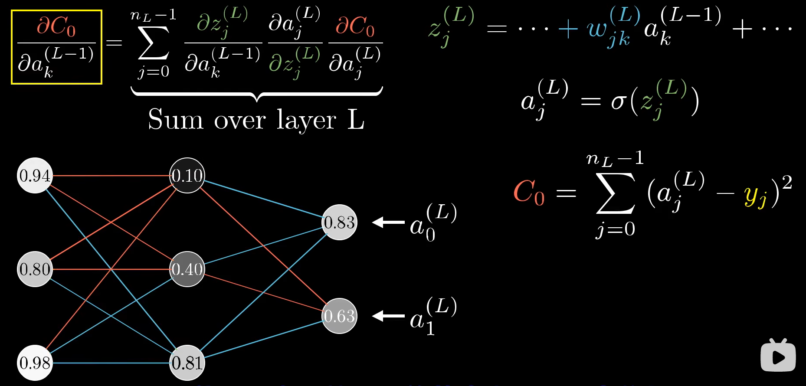

##### mini-batch的读取

`#Training cycle`

`for epoch in range(training_epochs):`

​	`#loop over all baches`

​	`for i in range(total_batch):`

每进行一个epoch则将所有数据都训练了一遍即训练了一个Batch的数据，由于mini-Batch将整个Batch又进行了分割，故需要在epoch下循环将每个mini-Batch都训练一次，Batch-Size为每个mini-batch的数据量，iteration为训练batch-size大小的数据的次数。batch-size*iteration=Batch的总大小

使用dataset、dataloader对整个batch的数据进行存储和读取，dataset中存储的数据需要能进行按索引读取，即实现__getItem__() ,取数据的过程又根据文件的大小分为全部读入，和使用时按索引读入。

#### 5.神经网络

#####  卷积  

卷积用极简的数学形式描述了一个动态过程

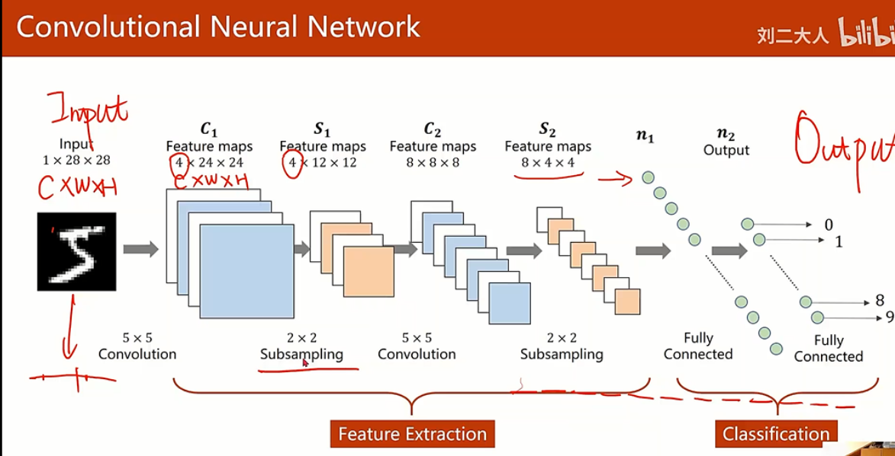

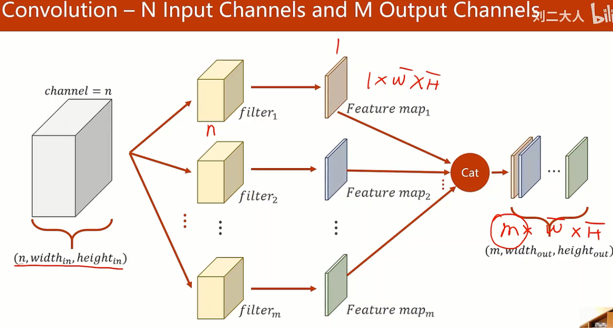

一个卷积核计算出一个通道的输出结果，m个卷积核则输出的通道为m个。卷积核的通道数跟输入数据的通道数相同(输入的每一个通道都要对应一个卷积核)。故上图中对应输入(n,width_in,height_in),输出(m,width_out,height_out)的卷积核为(m,n,kernel_size_width,kernel_size_height) ,个卷积块，每个卷积块中有对应输出通道数的单通道卷积。

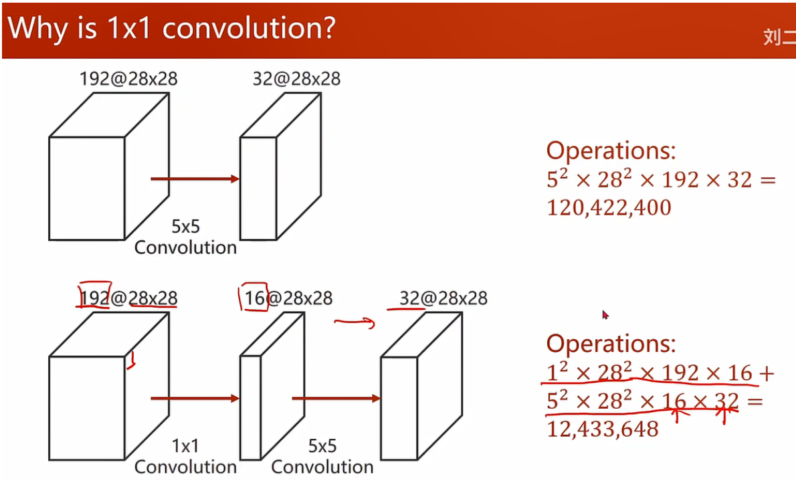

1X1卷积可以减少运算量，实际效果如何？

##### 循环

增加了时间的概念，纵向扩宽了神经网络 

RNNCell的本质是一个线性层

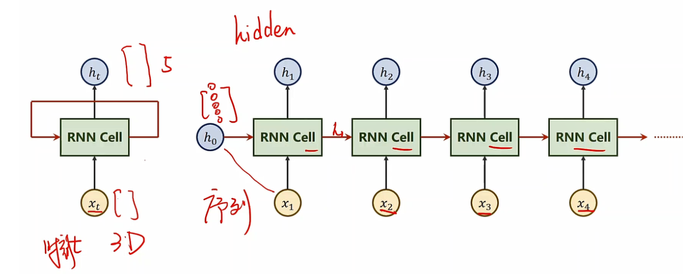

图左实际作用为图右，即同一个线性层反复使用（权重w不变）

RNN中为什么用tanh比较多？

RNN公式：(i为inputsize，h为hiddensize，h为某一时刻的hidden)

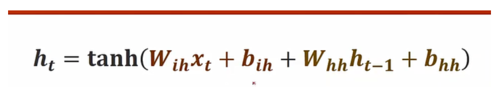


one-hot 向量存在的问题:1.高维 2.稀疏 3.硬编码

应改进为1.低维 2.稠密 3.通过学习得来

解决问题为使用embedding，即进行如下映射（降维）

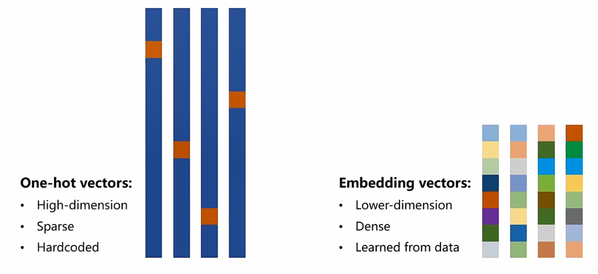

Pytorch中使用RNNCell与RNN的区别为个体与整体的区别

```python
dataset = torch.randn(seq_len,batch_size,input_size)

hidden = torch.zeros(batch_size,hidden_size)

rnn_cell = torch.nn.RNNCell(input_size,hidden_size)

for index,input in enumerate(dataset):`
​	print(' index',index)`		
​	print('inputsize',inputsize)`
​	hidden = rnn_cell(input,hidden)`
input.shape=(batchSize,inputSize)

hidden.shape=(batchSize,hiddenSize)
```


`dataset = torch.randn(seq_len,batch_size,input_size)`

`hidden = torch.zeros(batch_size,hidden_size)`

`rnn_cell = torch.nn.RNNCell(input_size,hidden_size``)`

`for index,input in enumerate(dataset):`

​	`print(' index',index)`		

​	`print('inputsize',inputsize)`

​	`hidden = rnn_cell(input,hidden)`

input.shape=(batchSize,inputSize)

hidden.shape=(batchSize,hiddenSize)

rnncell中构建模型时batchSize只有在初始化h0时才用得到

def init_hidden(self):

​	return torch.zeros(self.batch_size,self.hidden_size	)


`rnn = torch.nn.RNN(input_size,hidden_size,num_layers)`

`#inputs为整个输入序列，out为h1~hn，hidden为hn，所需参数hidden即为h0`

`inputs = torch.randn(seq_len,batchSize,inputSize)`#由于输入是整个序列故新添加了seq_len

`hidden = torch.zeros(numlayers,batchSize,hiddenSize)`

`out, hidden = rnn(inputs,hidden)`

**input.shape=(seqlen,batchSize,inputSize)**

**h_0.shape(numlayers,batchSize,hiddenSize)**

**output.shape=(seqlen,batchSize,hiddenSize)**

**h_n.shape =(numlayers,batchSize,hiddenSize)**

##### 6.感知机

o=σ(<w,x>+b)   σ(x)={1 if x>0, -1 otherwise}

即为一个二分类问题。

对比线性回归其输出的是一个实数，而SVM输出的是一个类

对比Softmax回归其输出的是n个类的概率，而SVM只输出单一类

###### 感知机训练

​	

```
initialize w=0 and b=0
repeat
	//符合if条件即预测错误
	if yi[<w,xi> + b]<=0 then
		w <- w + yixi and b <- b + yi
	end if
until all classified correctly
#相当于loss函数为
l(y,x,w) = max(0,-y<w,x>)
```

**多层感知机**（MLP，Multilayer perception)/(FNN，Fully-connected Neural Network)/前馈神经网络

使用隐藏层和激活函数来得到非线性模型

$h = σ(W_1x+b_1) $

$o=w_{2}^{T}h+b_2$

若σ为线性函数，则整体作用等价于一个单层感知机

即将h带入后$o=aw_{2}^{T}W_1x+b^{'}$

常用的激活函数：sigmoid、tanh、ReLU

##### 训练误差、泛化误差

训练误差：模型在训练数据上的误差

泛化误差：模型在新数据上的误差

计算误差的数据集：验证数据集(不能跟训练数据有交叉)、测试数据集(真正的测试数据集是只用一次的)

当超参数是在验证数据集上调出时，并不代表对于新的数据的泛化能力

###### K-则交叉验证

当没有足够多的数据时，将训练数据分为k块

| k     | 1        | 2        | 3        |
| ----- | -------- | -------- | -------- |
| step1 | validate | train    | train    |
| step2 | train    | validate | train    |
| step3 | train    | train    | validate |

常用k=5或10

一般将整个数据集划分为**训练+验证**（可以使用K-则交叉验证对这一部分进一步划分）、**测试**

##### 过拟合、欠拟合

过拟合即模型对于训练数据过于精细化地捕捉即捕捉了过多的不具有普适性的噪音，相当于考试背答案，数据少模型大时容易出现该问题

| -          | 数据简单 | 数据复杂 |
| ---------- | -------- | -------- |
| 模型容量低 | 正常     | 欠拟合   |
| 容量高     | 过拟合   | 正常     |

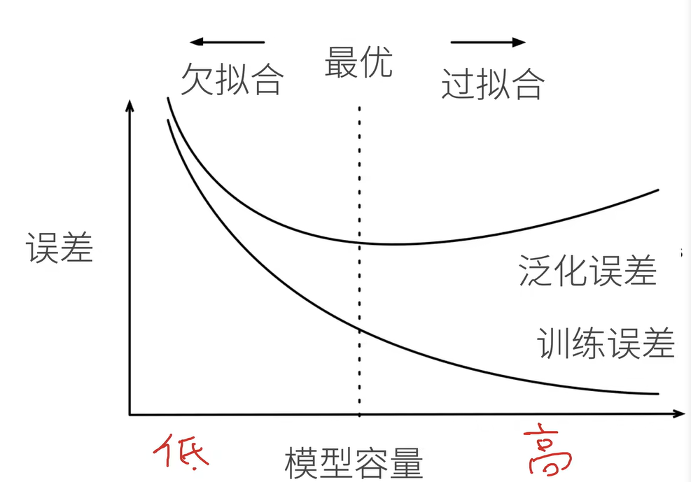

泛化误差会随着模型变大后过于关注训练数据的细节而变大

给定一个模型种类，影响其的两个因素：参数个数、参数值的选择范围

###### 权重衰退

最常见的处理过拟合的方法，是通过约束参数的取值范围来实现的。

比如使用均方范数作为柔性限制$min \space l(w,b)+\frac{λ}{2}||w||^2$ 该柔性限制影响效果如下，将原本的最优解往原点方向拉扯了。新增加的项称为惩罚项


加入惩罚项后梯度更新法则如下：

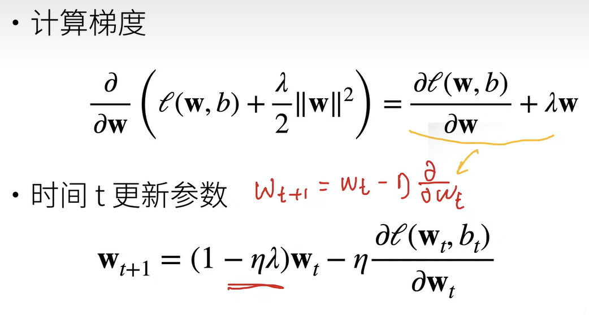

通常$λ*η<1$，即每次将$w_t$缩小后再进行梯度更新，也因而被称为权重衰退

###### 丢弃法

对x加入噪音得到x', $E[x']=p*0+(1-p)\frac{x}{1-p}=x$

dropout是正则项，只在训练中使用(类似于MLM)，每次只随机采样一部分子cell进行传递


###### 数值稳定性

常见的两个问题：梯度爆炸、梯度消失

梯度爆炸会导致值超出值域、对学习率敏感

梯度消失会使得梯度值变为0，从而训练不会有进展，对回传到的底部层影响尤为严重

解决方法：

1.将乘法变加法，比如ResNet、LSTM

2.归一化，梯度归一化、梯度裁剪

3.合理的权重初始化和激活函数：

将每层的输出和梯度看作是随机变量，并让它们的均值和方差都保持一致

###### 序列模型

马尔可夫假设：当前数据只跟τ个过去数据点相关

$p(x_t|x_1,……,x_{t-1})=p(x_t|x_{t-τ},……x_{t-1})=p(x_t|f(x_{t-τ}，……，x_{t-1})$

可以使用MLP对已知的τ个数据进行自回归

潜变量模型：引入潜变量h_t来表示过去信息$h_t = f(x_1,……,x_{t-1})$,即$x_t=p(x_t|h_t)$

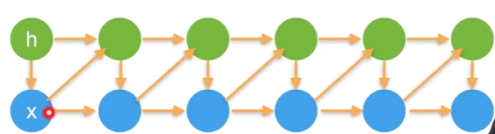

可以分为两部分：1）通过前一时刻的$h_{t-1}$和x算当前时刻的h 2)根据算出的当前时刻h, 以及前一时刻的x算出当前时刻x

###### 语言模型

估计文本序列的联合概率给定文本序列x1，……，Xt，语言模型的目标是估计联合概率p(X1,……,Xt)

应用于1）预训练模型(e.g. bert,gpt-3) 2)生成文本，给定前面几个词，不断使用Xt~p(Xt|X1,……,Xt)生成后续文本 3）判断多个序列中哪个更常见(e.g. “to recognize speech”和“to wreck a nice beach” )

使用计数来建模 其中n为corpus的数量（n-gram）

seq_len=2时$p(x,x')=p(x)p(x'|x)=\frac{n(x)}{n}\frac{n(x,x')}{n(x)}$  n(x,x')为x与x'连续出现的次数

seq_len=3时$p(x,x',x'')=p(x)p(x'|x)p(x''|x,x')=\frac{n(x)}{n}\frac{n(x,x')}{n(x)}\frac{n(x,x',x'')}{n(x,x')}$

当序列很长时，可以用马尔可夫假设：

一元语法即τ=0 每个token在序列中出现概率都独立  $p(x_1,x_2,x_3,x_4)=p(x_1)p(x_2)p(x_3)p(x_4)$

二元语法 τ=1 每个token只与其前一个相关  $p(x_1,x_2,x_3,x_4)=p(x_1)p(x_2|x_1)p(x_3|x_2)p(x_4|x_3)=\frac{n(x_1)}{n}\frac{n(x_1,x_2)}{n(x_1)}\frac{n(x_2,x_3)}{n(x_2)}\frac{n(x_3,x_4)}{n(x_3)}$

三元语法 τ=2 每个token至多与其前两个相关 $p(x_1,x_2,x_3,x_4)=p(x_1)p(x_2|x_1)p(x_3|x_1,x_2)p(x_4|x_2,x_3)$

语言模型的输出就是判断下一个token，若字典大小为m，则为m分类问题，可以使用CrossEntropyLoss来衡量损失

衡量一个语言模型好坏可以使用**平均交叉熵**：

$π=\frac{1}{n}\sum_{i=1}^n-logp(x_t|x_{t-1},……)$

p(x_t|x_{t-1},……)即真实词的softmax输出

NLP使用**困惑度(perplexity**)，exp(π）来衡量，困惑度=1则说明只有一种可能，=k则k个token都有可能

RNN应用：

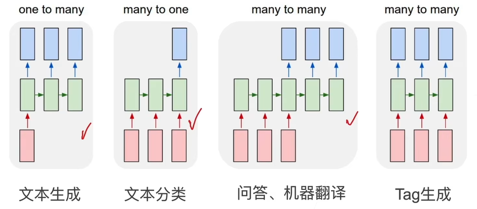

###### 梯度裁剪

如果梯度长度超过θ，则将其重置为θ。梯度裁剪可以有效预防梯度爆炸

$g<—min(1,\frac{θ}{||g||})g$

#### 从预训练到bert发展历程 

##### 预训练

预训练（最早在图像领域使用）是通过一个已经训练好的模型A，去完成一个小数据量的任务B（使用A的**浅层参数**

前提为任务A和B极其相似

预训练分为Frozen、Fine-Tuning两种，前者为与训练好的浅层参数不改变，后者将随下游任务进行改变。

预训练用法

fairseq、transformers库

##### 统计语言模型

###### 语言模型

是完成类似以下任务的工具

1.<u>**比较任务**</u> 判断句子出现的概率大小 P（“判断这个词的词性”），P（“判断这个词的雌性”）

2.**<u>预测任务</u>**token的推理 “判断这个词的`_____`”

**统计语言模型**则为使用统计的方法解决以上问题

以下使用了条件概率的链式法则

首先进行分词 “判断这个词的词性”=”判断“+”这个“+”词“+”的“+”词性“

再根据公式求出整句话出现的概率

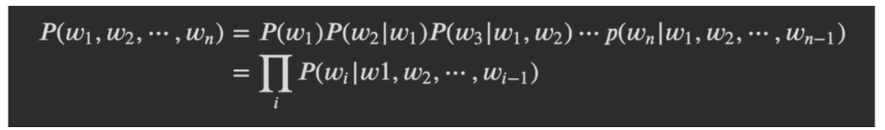

第二个问题则为P(w_next|"判断"，"这个"，"词"，"的")

将词库中的词装入集合V, 把集合中的每一个词，都进行以上计算求max

当存在P(w_next|"判断"，"这个"，"词"，"的"，……)后缀很长时，计算量则增大，为了减少计算量，提出了n元计算模型。

###### n元统计语言模型

P(词性|"这个"，"词"，"的")

P(磁性|"这个"，"词"，"的")

P(词性|"词"，"的")

P(磁性|"词"，"的")

即把n个词，取2个词(2元)，3个词(3元)

如何去计算

```basic
“词性是动词”
“判断单词的词性”
“磁性很强的磁铁”
“北京的词性是名词”
```

P(词性|的)=$\frac{cout(词性，的)}{count(的)}$=$\frac{2}{3}$

P(策略|平滑)=$\frac{cout(平滑，策略)}{count(平滑))}$$\frac{0}{0}$

不存在的改用 *|V|*为词库大小，从而避免分子分母都为0，该方法称为平滑策略

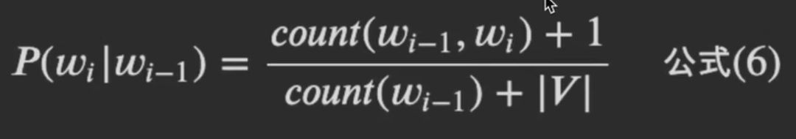

##### 神经网络语言模型

使用神经网络的方法去完成以上两个任务

完成该任务的前提是让计算机认识单词，所以有以下方式

###### 独热编码(one-hot)


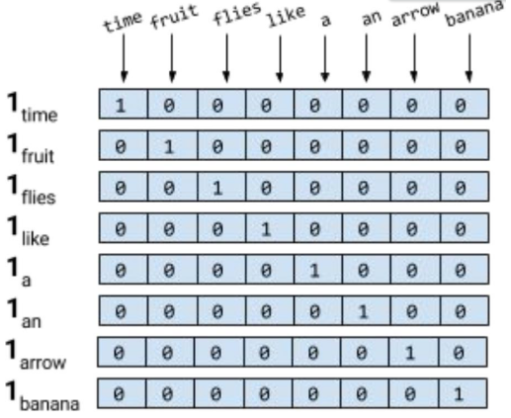

假设词典V中有8个单词，则one-hot给出一个8*8的矩阵，其中

“banana”对应00000001

“fruit”对应      01000000

该向量关系显然无法用余弦相似度计算二者相似度


NNLM主要用来==预测下一个词== 公式为

$softmax(W_1(tanh((W_2,C)+b1)+b2)$

```basic
w1*Q=c1
w2*Q=c2
w3*Q=c3
w4*Q=c4
C=[c1,c2,c3,c4]
//Q是一个随机矩阵，是可学习的参数
```

这个替代one-hot的c，即为判断该词的**词向量**

###### 词向量

解决了one-hot占用存储空间过大，以及无法计算余弦相似度的问题

通过Q矩阵可以控制词向量的维度

并且乘出的新向量可以进行余弦相似度的计算


其中**Q矩阵的精准度合理度非常重要**，也推动着后期的发展

有了词向量后，也同时具备了完成**任务一**的条件。(下游任务？训练好Q以后任何子token即具有了词向量，从而可以处理更为细节的任务)

###### Word2Vec

也是神经网络语言模型->专门用来生成词向量

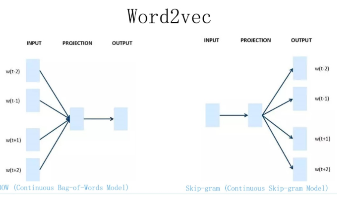

word2Vec是一类模型分为

**CBOW**

给出一个词的==上下文==，预测该词

**Skip-gram**

给出一个词，预测这个词的上下文

二者都是为了得到Q矩阵，而NNLM则为了预测下一个词

故二者是为了训练好input端的Q矩阵

1. CBOW一个老师告诉多个学生，Q矩阵如何变
2. Skip-gram为多个老师告诉一个学生Q矩阵如何变

###### NNLM与Word2Vec区别

NNLM重在预测准确性，使用双层感知机$softmax(W_1(tanh((W_2,(x*Q))+b1)+b2)$

Word2Vec不在意预测准确性，故去掉激活函数，提高了计算效率

###### Word2Vec缺点

1. 无法表示多义词(由ELMO解决)

Word2Vec模型是否属于预训练模型?  `属于`


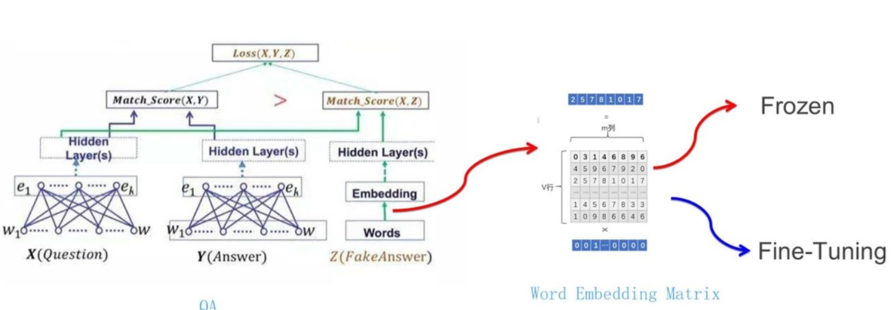

如上图从words到embedding可以使用Word2Vec模型预训练好的Q矩阵直接将one-hot转换为词向量，故其属于预训练模型，从而也有两种使用方式1.Frozen冻结2.Fine-Tuning微调

###### ELMo模型

不只是训练一个Q矩阵，并且将上下文信息融入到Q矩阵中

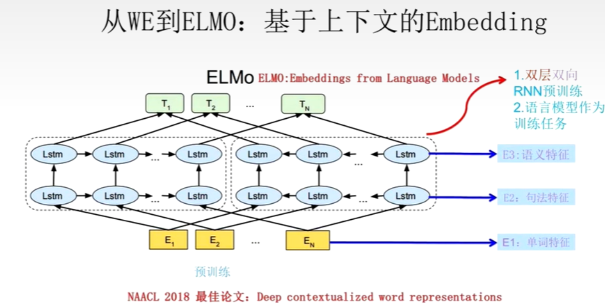

左边的LSTM获取En的上文信息，右边获取En的下文信息

通过上下文信息得到了词向量Tn，该词向量中包含了(多层特征：语义特征、句法特征、单词特征)

由于句法特征、语义特征在不同句子环境汇总不同，故同一个单词在不同句子中的词向量会有区分

###### Attention

对于一个模型(CNN、LSTM)很难决定什么数据重要或不重要


而人会根据图片中成分的重要性去聚焦

注意力机制中则是通过计算查询对象Q和被查询对象V之间的相似度来衡量重要性的

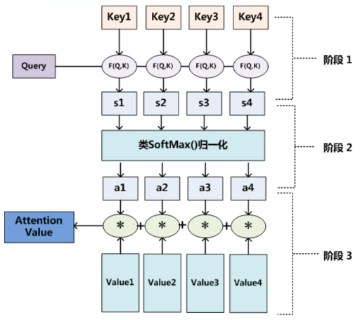

$(K_1,K_2,\cdots,K_n)*(Q_1,Q_2,\cdots,Q_n)=(s_1,s_2,\cdots,s_n)$

$softmax(s_1,s_2,\cdots,s_n)=(a_1,a_2,\cdots,a_n)$

$(a_1,a_2,\cdots,a_n)*+(V_1,V_2,\cdots,V_n)=(a_1*V_1+a_2*V_2+\cdots+a_n*V_n)=V'$

一般K=V，在Transformer中，K可以！=V但K和V之间一定有某种联系，这样QK计算来的相似度对于V的重要性才有意义

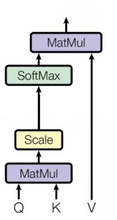

QK相乘求相似度后进行缩放，防止softmax后差距过大(指数函数增量大)，softmax后得到概率，V相乘后得到的$V^`$中隐含了V中信息对于Q而言的重要程度

###### self-attention

关键在于Q$\approx$K$\approx$V来源于同一个X(对X用不同的矩阵$W^Q、W^K、W^V$做空间变换得来)，即在注意力机制的基础上添加了约束条件

以下为处理第一个单词“Thinking”时self-attention的流程

1.通过学习来的$W^Q、W^K、W^V$以及词向量乘得q、k、v

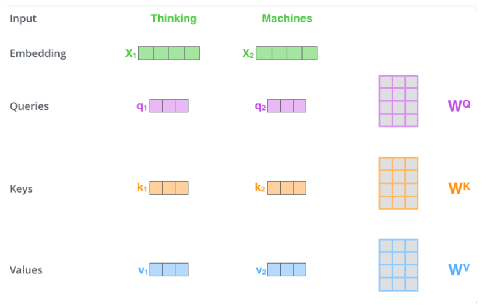

2.分别计算q1 * k1、q2 * k2得到句子中所有成分对“Thinking”的注意分数

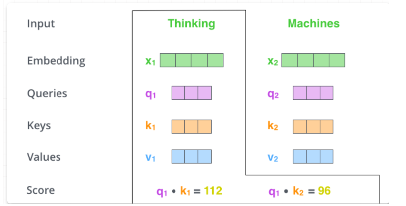

3.对score进行缩小，即除以$\sqrt{d_k}$，假设key的维度为64，则除以8（*为什们是除以k的维度？*）

4.对scale之后的分数进行softmax

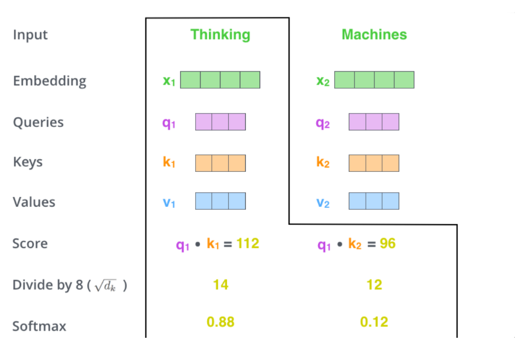

5.将每个value向量乘softmax后的得分并求和得到新的$z_1$


$z_1=0.88*v_1 + 0.12*v_2$

self-attention相较于RNN、LSTM解决了长序列依赖问题，并且得到的新的**词向量**中包含了句法特征和语义特征（预训练语言模型优化的目的就是为了使词向量中内容更为准确，更有用）

句法特征

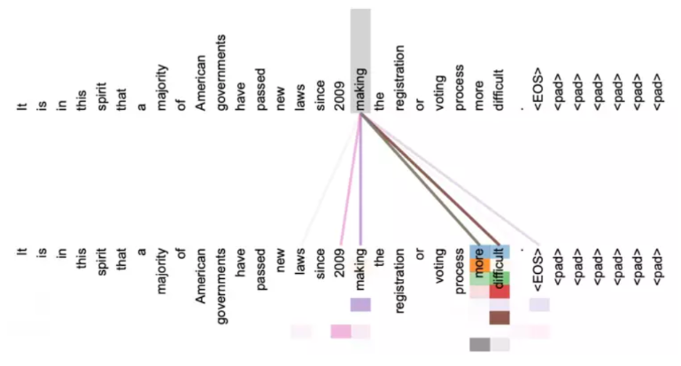

语义特征

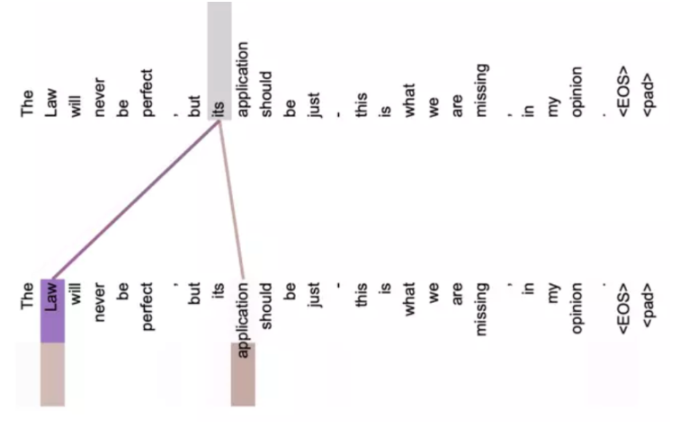

带掩码的Masked Self-attention

由于在做生成任务时，生成的句子中单词是一个一个生成的，在计算注意力时不应将未生成的单词计算在内，故去掩码将其先掩盖

未做掩码前，一次性全部并行计算

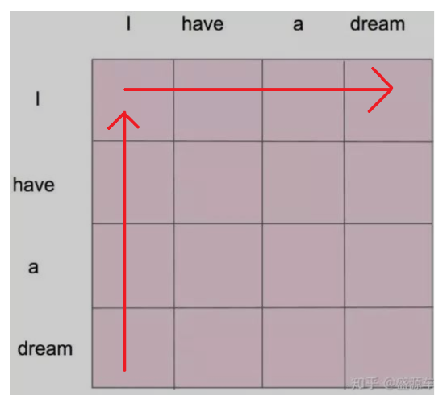

加掩码后逐步计算(先计算已生成的单词)


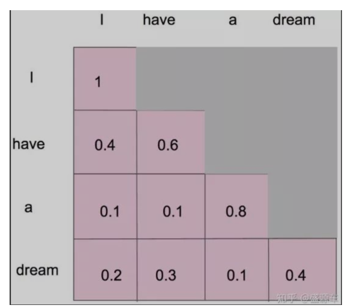

上三角mask与pad mask求并集

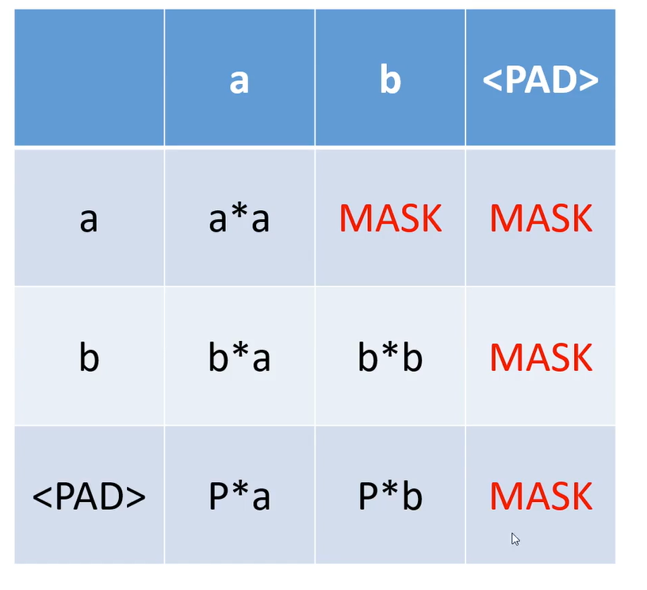


###### muti-head self-attention

即将输入词向量分成多个通道进行self-attention(从多个维度向结果进行逼近)，然后将每个通道的得分结果重组为一个

工作流程

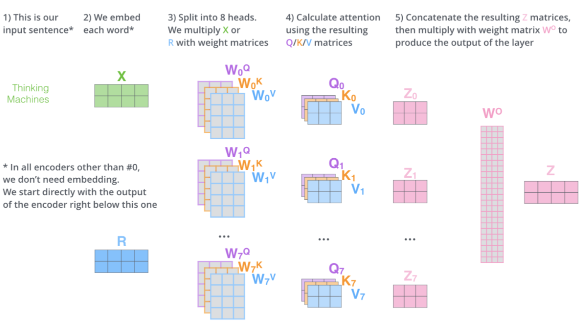

###### position encoding

self-attention的并行提高了计算效率，但增大了计算量（句子中的词与每个词的关系），并且失去了位置信息，故需要将位置信息添入新的词向量中

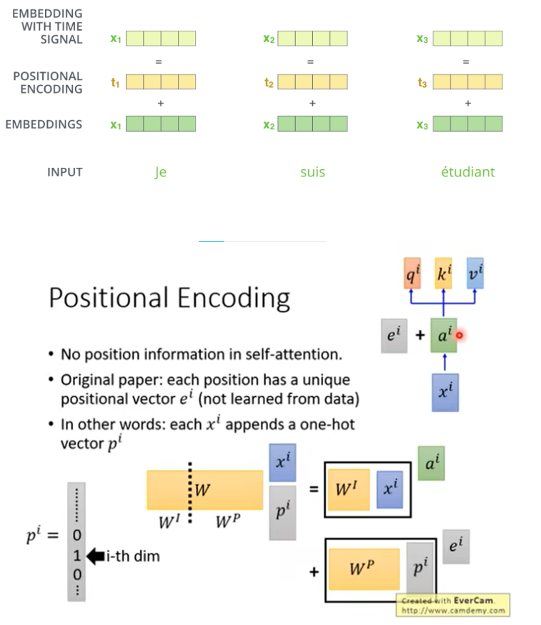


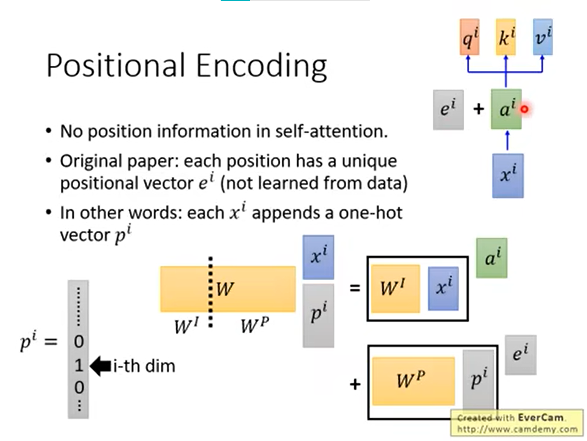

具体公式：

$PE_{(pos,2i)}=sin(pos/10000^{2i/d_{model}})$

$PE_{(pos,2i+1)}=cos(pos/10000^{2i/d_{model}})$

根据
$$
\begin{cases}
sin(α+β)=sinαcosβ+cosαsinβ\\
cos(α+β)=cosαcosβ-sinαsinβ
\end{cases}
$$
将PE根据奇偶性展开得到
$$
\begin{cases}
PE(pos+k,2i)=PE(pos,2i)*PE(k,2i+1)+PE(pos,2i+1)*PE(k,2i)\\
PE(pos+k,2i+1)=PE(pos,2i+1)*PE(k,2i+1)-PE(pos,2i)*PE(k,2i)
\end{cases}
$$
对于pos+k位置的位置向量的某一维度2i或2i+1而言，可以表示为pos位置与k位置的位置向量的2i与2i+1维的线性组合

###### Transformer

seq2seq model with self-attention

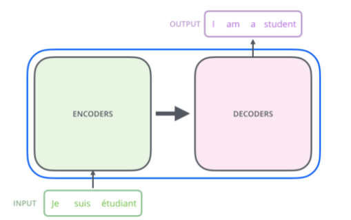

是一个seq2seq模型，序列到序列

编码器：把输入变成一个词向量(self-attention)

解码器：获取词向量后生成翻译结果


模型中Nx即层数，默认使用了6个编码器(每一块都是一个self-attention)，逐步增强词向量的精准度

编码器具体结构步骤

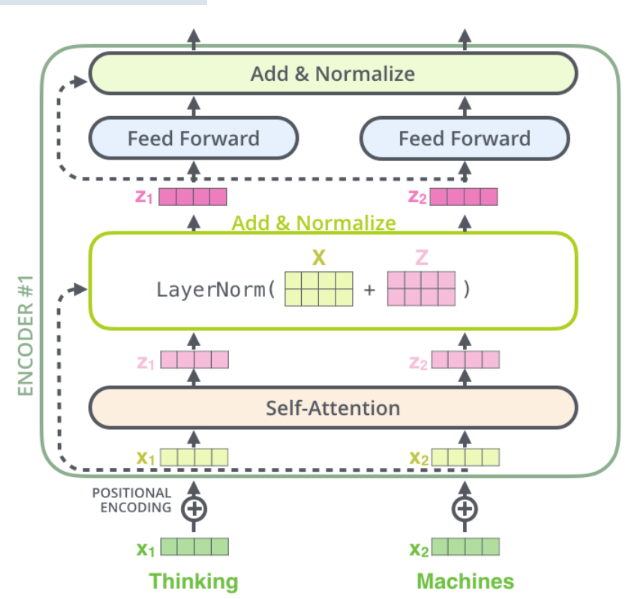

”Thinking“—>词向量x1(通过one-hot、word2vec等得到)+positional encoding—>x1'—>输入到self-attention与其他词向量此处为x2计算注意力—>z1 (该词向量具有位置、句法、语义信息)—>残差连接(避免梯度消失)+归一化—>z1''—>feedforward，Relu(w2(w1x+b1)+b2),此前都只在做线性变换(空间中的平移和放缩)，relu则是非线性变换，如此才可以拟合空间中的任一状态—>r1


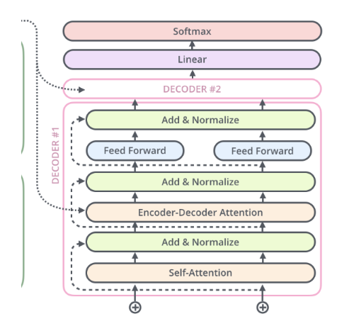

decoder的self-attention对已经生成的词进行编码，所以应该加mask

Transformer工作流程，其中decoder(masked)通过已生成的单词得到Q，encoder则用整句话生成K、V,再传给decoder单个块中的第二层Encoder-Decoder Attention做self-attention


用Q与源语句K、V做自注意力机制，则可以知道源语句中哪些成分对接下来要生成的词更重要

###### GPT

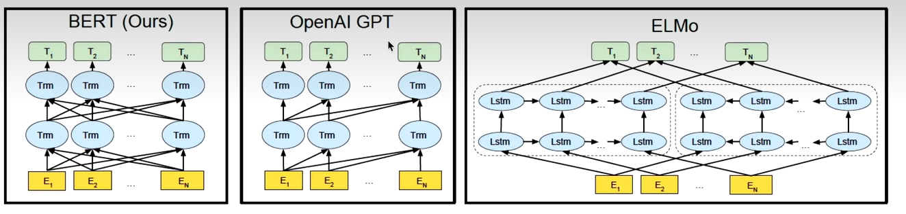

gpt无法做下游任务改造，因为其训练的是整个模型，即已经带有具体任务。对比于ELMo只用来生成更为精确的词向量，其输出结果可以与不同的下游任务对接

###### bert

参考了ELMO模型的双向编码思想，借鉴了GPT用Transformer作为特征提取器的思路，采用了word2vec所使用的CBOW方法

双向编码导致了需要看下文信息故无法进行生成式任务，而GPT则是单向生成式

对比ELMO使用的LSTM是按序传递(无法同时看到上下文，只是单独看到并作拼接)，BERT使用的Attention能同时看到上下文信息

bert训练和GPT一样，分两步：

第一阶段：使用容易获取的大规模无标签数据，来训练基础语言模型

第二阶段：根据指定任务的少量带标签数据进行微调训练

不同于GPT使用$P(w_i|,w_1,……,w_{i-1})$,由于bert能看到全局信息，所以使用$P(w_i|,w_1,……,w_{i-1}，w_{i+1},……,w_n)$为目标函数

由于使用的是Transformer的Encoder所以能看到整个上下文所以无法使用完形填空CBOW的思想

其解决方法是，在输入时将句子mask15%的token，然后让模型预测被masked的token，该方法称为MLM。该方法只在训练阶段使用，测试阶段不使用。

使用Mask后导致模型更多地关注在了被mask掉的token上

由于训练与测试阶段输入数据的不同故将被mask掉的15%又分为80%的[Mask]、10%的不改变、10%的错误替换，这样使得模型对于除mask掉之外的词也会被模型加以注意(否则将会认为除了[Mask]之外的所有数据都是正确的)

bert中的NSP（下句预测），由于语言模型不具备获取句子间信息的能力，因此bert采用了NSP作为无监督预训练的一部分。具体做法：bert输入的语句由两个句子构成，其中50%概率将语义连贯的两个连续句子作为训练文本(连续句对一般选自篇章级别的语料，来确保前后语句的语义相关性)，另外50%的概率将完全随机抽取两个句子作为训练文本。

>连续句对：[CLS]今天天气很糟糕[SEP]下午体育课取消了[SEP]
>
>随机句对：[CLS]今天天气很糟糕[SEP]鱼快被烤焦了[SEP]

其中[SEP]表示分隔符，[CLS]用于类别预测，结果为1则表示连续，0则表示不连续即随机句对，通过训练[CLS]编码后的输出标签，BERT可以学会捕捉两个输入句对的文本语义。

Bert在通过预训练知道对应的词和句子的表达后，再对其进行一定的引导即下游任务的改造

>发展历程参考自https://www.cnblogs.com/nickchen121/p/16470569.html

###### RNN

$h_0=f(Wx_0+b)$   $y_0=g(Wh_0+b)$

$h_1=f(Wx_1+Wh_0+b)$   $y_1=g(Wh_1+b)$

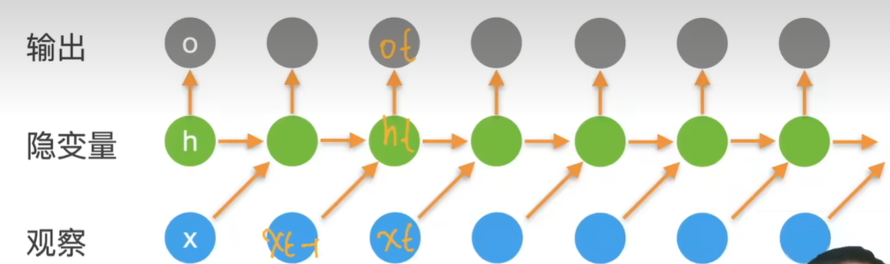

当前时刻的输出是预测当前时刻的观察，但是输出发生在观察之前。在计算损失时比较Ot和Xt,但Xt用来更新Ht+1

$h_t=f(W_{hh}h_{t-1}+W_{hx}x_{t-1}+b_h)$

去掉$W_{hh}h_{t-1}$将退化成MLP，即增加了前一刻h与当前输出的相关性

$o_t=W_{ho}h_t+b_o$

具有L个隐藏层的**深度RNN**，每个隐状态都连续地传递到当前层的下⼀个时间步 和下⼀层的当前时间步

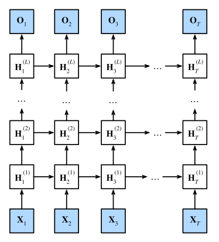

由于未来的语境会影响当前预测词，故出现**双向RNN**

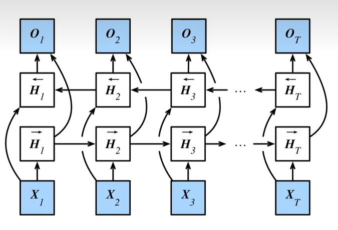

其实现相当于序列正向计算隐状态，序列反向计算隐状态再reverse，最后将对位的隐状态concat得到Ht

最后输出$O_t = H_tW_{hq}+b_q$

由于双向RNN能看到上下文信息，因此通常用来对序列抽取特征、填空，而不是预测未来

###### lstm 

**输入门**作用于当前时刻的输入值，**遗忘门**作用于上一时刻的记忆值，二者加权求和得到汇总信息

最后通过**输出门**决定输出值

三个门的计算公式都为$sigmoid(Wx+Wh+b)$

$I_t=σ(X_tW_{xi}+H_{t-1}W_{hi}+b_i)$

$F_t=σ(X_tW_{xf}+H_{t-1}W_{hf}+b_f)$

$O_t=σ(X_tW_{xo}+H_{t-1}W_{ho}+b_o)$

增加了候选记忆单元$C^{'}_t$

$C^{'}_t=tanh(X_tW_{xc}+H_{t-1}W_{hc}+b_c)$

对于计算结果$C_t$来说$F_t$和$I_t$相对独立，不像GRU中相互牵制

$C_t=F_t*C_{t-1}+I_t*C^{'}_t$

$C_t$在计算后由于$C_{t-1}$、$C^{'}_t$都在(-1,1)之间所以相加后范围在(-2，2)之间，故需要将其拉回(-1,1) 。并使用$O_t$对于输出即传递给H_t的信息再加以控制

$H_t = O_t*tanh(C_t)$

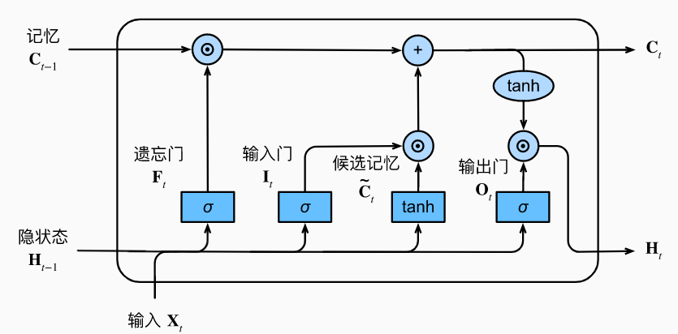

thinking: LSTM添加一个传递的C协助更新隐藏状态H，是否可以添加多层似C的记忆传递单元并协助更新H

使用C后效果更好是不是由于对前文状态信息放大再缩小后的结果

###### GRU

对于RNN来说前面随着隐藏状态的累积，更早时候输入传递过来的信息将会被弱化。

而对于连续的信息，并不是每个信息都同等重要，其中不乏有关键词更应重视，为达到只关注某些部分的目的，需要加入gate门。

GRU加入了**更新门**、**重置门**(可学习权重是RNN的三倍)

$R_t=σ(X_tW_{xr}+H_{t-1}W_{hr}+b_r)$

$Z_t=σ(X_tW_{xz}+H_{t-1}W_{hz}+b_z)$

加入候选隐藏状态，用于$H_{t-1}$与重置门进行操作通过学习参数选择忘掉一部分之前的隐藏信息

$H^{'}_{t}=tanh(X_tW_{xh}+(R_t*H_{t-1})W_{hh}+b_h)$

最终使用候选隐藏状态和更新门计算新的隐藏状态

$H_t = Z_t*H_{t-1}+(1-Z_t)*H^{'}_t$

 特殊的，当$Z_t$全0，$R_t$全1时等价于RNN;当$Z_t$全1时，将不看当前输入$X_t$直接更新$H_t $

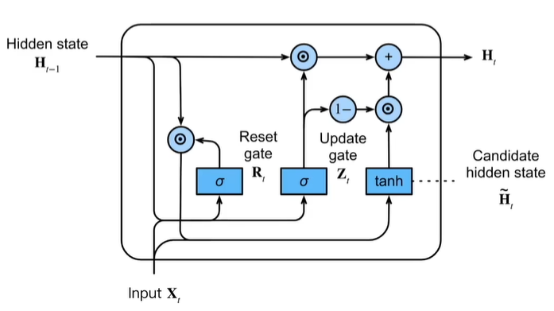

thinking:实际实现的是对ht的压缩？

###### encoder-decoder架构

encoder将输入编程为中间特征表达，decoder将中间特征编码输出

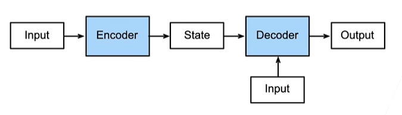

###### seq2seq

最早用来做机器翻译


其中encoder使用的是RNN输出为最后的隐层，将该隐藏状态输出给解码器的隐状态，decoder是没有输出的RNN

，在训练阶段如右图，decoder每次输入的是正确的序列从而避免误差累积

而对于推理任务，只能将上一时刻的输出作为下一时刻的输入


###### BLEU

$p_n$是预测中所有n-gram的精度

对于标签序列A **B C D** E F 和预测序列A B B C D而言，p1 = 4/5 (n=1即连续一个预测成功) p2 = 3/4（n=2 连续预测两个成功 AB <u>BB</u> BC CD 中成功预测3个）p3 = 1/3 (n=3 ABB BBC **BCD**中成功1个)

其值越大预测效果越好，最大=1. 其定义为：

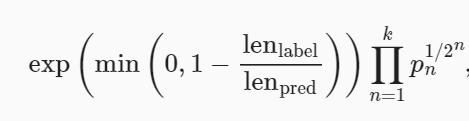

其中exp(min())部分是为了防止预测的长度短于标签长度,即$len_{pred}<len_{label}$时将会使计算$e^{-x}$，从而拉低分数

后半部分n是匹配长度，其中$p_n<=1$，当n越大时当前项越大，即长匹配有高权重