## 论文精读

方法论：

三遍：

1. 标题+摘要+结论+实验部分图表 最终决定是否继续读
2. 重要图表的详细内容+圈出引用文献 
3. 复现作者的思路，并有自己的想法

①标题+作者

②摘要

③结论

④导言

⑤相关工作

⑥模型

⑦实验

⑧评论

### 1. Transformer 

②主流的序列转录模型（由所给序列生成目标序列）大多都基于复杂的循环或卷积神经网络，都有一个编码器和解码器。其中表现最佳的模型也会在编码器和解码器之间使用到注意力机制。基于注意力机制作者提出了一个新的简单的神经网络架构，**Transformer**，该模型仅仅基于注意力机制。

③Transformer 是第一个仅仅使用注意力机制的转录模型，它将之前的在编码解码器之间使用的循环层替换为了multi-head self-attention

在机器翻译这一任务上，Transformer训练地比其他传统的架构都要快。

④RNN对于一个序列的计算是从左往右一步一步做，对于第t个词会计算隐藏状态ht，该ht由前一个词的ht-1和当前词一起决定。该时序性的计算使得并行难以进行。

​	并且Attention机制早已应用于编码器与解码器的结合部，用来使编码器的东西很有效地传给解码器。

​	Transformer不再使用之前的循环神经层，而是仅使用注意力机制去描绘输入和输出之间的全局依赖关系。它支持更强的并行，并且可以在更短时间内完成更为高质量的任务。

⑤  Extended Neural 、GPU ByteNet 、ConvS2S都通过使用卷积神经网络为基本单位进行构建，并行计算所有输入输出位置的隐藏表示，从而减少顺序计算增加并发度。对于这些模型，将来自两个任意输入或输出位置的信号关联起来所需的操作数量随着位置之间的距离而增长，对于ConvS2S来说是线性增长，对于ByteNet来说是对数增长。

​	而在Transformer这些运算的数量被减少到了常量级别，以此为代价的是由于注意力权重位置的平均化导致的辨识度的降低，对于这一缺点，采用Multi-Head Attention机制来解决。

​	Self-attention,或者称为intra-attention，是将一个序列中不同位置关联起来的注意力机制，以计算序列的表示。

​	Transformer是第一个只使用自注意力机制来做encode、decode架构的模型

⑥ 大多数有竞争力的神经网络序列转录模型都有一个encoder-decoder架构。encoder将输入序列的符号表示x(x1,……xn)转换成一个连续的向量表示z(z1,……zn)。对于z decoder将一次解码出一个y最终生成序列y(y1,……yn)，每次生成都是一次auto-regressive自回归，对于yt则需要y1~yt-1作为输入。

 	Transformer也使用了encoder-decoder架构，具体来说该encoder-decoder使用了堆叠起来的self-attention 、point-wise和全连接层

​	编码器结构如下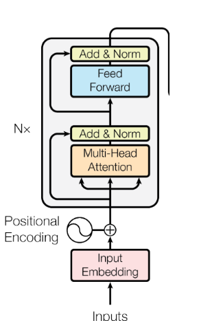

输入先进入嵌入层，将词转换为向量，随后连接的是N层的由Muti-Head Attention以及Feed Forward(前馈神经网络)构成的块，【Add&Norm】中连接到Add的为

**残差连接**

(将浅层输出与深层输出求和 we hypothesize that it is easier to optimize the residual mapping than to optimize the original, unreferenced mapping . To the extreme,  if an identity mapping were optimal, it would be easier to push the residual to zero than to fit an identity mapping by a stack of nonlinear layers 残差块使得训练很深的网络更加容易)，Norm为LayerNormalization

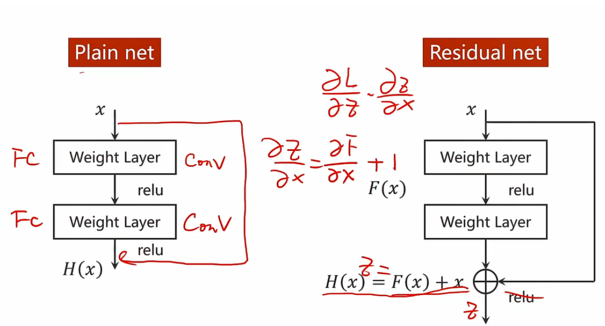

残差连接可以解决**梯度消失**的问题(防止梯度<1相乘后无限接近于0)，残差连接后使得梯度保持在1左右

在使用残差连接之前，更深的神经网络并不能比浅层神经网络具有更好的效果(更深的网络，误差率(训练+测试)反而更高)。

实际上浅层网络构建好后，后加的网络充当一个identity mapping 的话，深层网络的精确度不应该降低，但实际来说SGD并无法实现这一点。

残差连接则是将从前一层传递过来的$H(X)$不直接去学习，而是学习$H(X)-x$, 并在输出时加上那个减去的$x$.

即

《Identity Mappings in Deep Residual Networks》中介绍了各种residual块的设计。

​	LayerNorm与batchNorm比较(蓝色为batchNorm)，layerNorm是对一个样本所有特征进行计算，BatchNorm是对一个mini-batch中的一个特征进行计算

当输入为2D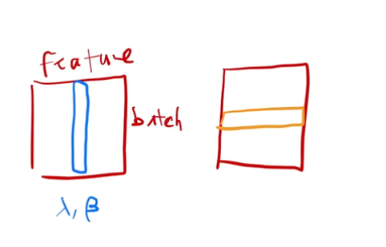

二者通过对数据的转置可以达到统一的效果

而RNN、Transformer中输入为3D，如图

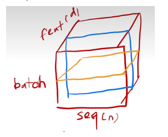

由于LayerNorm、BatchNorm两种切法不同以及每个序列长度的不固定性，导致了BatchNorm在每次小批量计算时的均值方差的抖动相对较大 ，同时也导致其全局的均值方差不准确（可能新的序列长度过长或过短）；而LayerNorm小批量计算的是每个样本自己的均值和方差，并且也没有必要存储全局均值方差（测试时），故相对稳定。

解码器结构如下

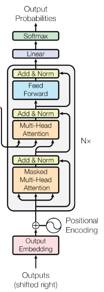

解码器的自回归机制(t-1时刻的输出作为t时刻的输入)，以及attention机制中能看到完整的输入，故需要带掩码的注意力机制即Masked Attention，来保证在t时间的输入不会看到t时间之后的内容

​	**Attention机制**就是将query查询内容根据键值对key-value中与key的相似度映射为一个output，其中key-value保持不变，随着query权重分配的变化，将会有不同的output。在计算相似度时，不同的Attention版本有不同的算法。(涉及到的所有数据都是向量)

​	Transformer在计算注意力时使用的是sclaed dot-product attention。该方法中query和key的维度相等，通过计算两个向量的内积来衡量其相似度，内积越大则相似度越高(？)（long相等的前提下）,**Attention(Q,K,V)=softmax(Q K内积/向量长度) V**。除以向量长度是防止两个向量长度比较长时，出现较大值的概率将会增加，该相对差距变大的可能性增加后使得softmax后该值更加靠近于1，剩余的值则更加靠近于0，在该种情况下softmax回归计算时梯度将会很小，不利于尽快收敛。而Transformer中的向量长度都是比较大的故应除以√dk。 计算流程图如下

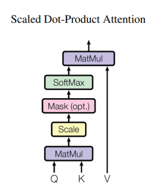

##### Muti-Head Attention

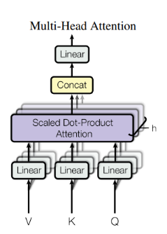

相较于单个的注意力函数直接去计算高维的向量，将其投影到低维度并行地去计算更有好处 ，如上图将V、K、Q分别进行投影，投影h次，而每次投影时的W是一直在学习的。
$$
MultiHead(Q,K,V) = Concat(head_1,……,head_h)W^o
$$

$$
head_i= Attention(QW_i^Q,KW_i^K,VW_i^V)
$$

##### Position-wise Feed-Forward Networks

实际上是一个全连接的前馈神经网络，用来作用于每一个词(position)
$$
FFN(x) = max(0, xW1 + b1)W2 + b2
$$
W1将d=512的x扩大到d=2048，线性相加后Relu，然后用W2将维度降回512，最后再线性相加

##### Positional Encoding

用与embedding后数据位数等长的数据来表示该数据原始的位置信息，相加后即携带了该词的位置信息 		

⑦编码器和解码器的embedding 由于使用了统一的字典所以共享权重

⑧**评价**：Attention并不是ALL you need，其中的前馈神经网络、残差连接都缺一不可 。

### 2. Bert

②Abstract

Bidirectional Encoder Representations from Transformers

Bert全称为transformer模型的双向编码器表示

bert使得NLP的语言模型预训练正式出圈，它与最近的语言表示模型不同，bert通过联合所有层中左右的上下文信息，使用无标签的数据来训练深层双向的表示。预训练的bert模型只需要一个额外的输出层就能得到一个不错的结果。

（论文成果在摘要中写明基于什么工作，并且相对于该工作有何提升，再给出具体的实验数据，绝对精度+与当前最优相比提升的精度）

It obtains new state-of-the-art results on eleven natural language processing tasks, including pushing the GLUE score to 80.5% (7.7% point absolute improvement), MutiNLI accuracy to 86.7% (4.6% absolute improvement) and SQuAD v2.0 Test F1 to 83.1(5.1 point absolute improvment)

已经存在的预训练模型分为基于特征的、基于微调的。

ELMo则属于基于特征的，每个下游任务都要构造一个与其相关的神经网络(RNN架构)，将预训练好的表示作为一个额外的特征同输入一起放入模型，使得模型训练起来比较容易。

GPT则是基于微调的，预训练好的参数在下游只需要微调

以上两个方案在预训练时都使用相同的目标函数，并且都使用单向的语言模型（为预测模型，预测下一个时刻所要输出的语言，故为单向）。

Bert则可用''带掩码的语言模型''(Masked language model, MLM)来减轻语言模型单向的限制，其灵感来自**Cloze task (Taylor，1953)**，具体来说，每次随机从输入中选择一些tokens并将其掩盖，目标函数则去预测这些被盖住的词（相当于进行完形填空），MLM允许去看左右两边的信息，这就使得我们可以训练出双向的深的Transformer

Bert是第一个在句子层面和词元层面取得好成绩的微调模型

③conclusion

最近一些实验表明，大量的、非监督的预训练对于很多语言模型来说是非常好的，这使得一些即使训练样本比较少的任务可以享受深度神经网络。bert的主要成果就是将已有成果拓展到了深的双向的架构上来，使得同样的预训练模型可以处理大量的不一样的NLP任务

⑤相关工作

非监督的基于特征的工作(ELMO)

非监督的基于微调的工作(GPT)

有标号的数据上做迁移学习

⑥BERT

该框架有两个步骤：1）预训练 2）微调

预训练时模型是在没有标号的数据集上训练的。

在微调时bert模型的权重被初始化为预训练时得到的权重，所有权重在微调时都会参与训练，并且使用的是下游任务的有标号的数据。

每一个下游任务都会单独建立一个模型并进行微调。

bert使用的架构是多层双向的Transformer编码器，该架构基于Transformer原始代码。

输入输出的表示上，输入统一为一个序列，从而无差别地表示一个句子或多个句子。这使得一个句子可以是连续文本中的任意跨度，而不是一个真实语义上的句子。

bert使用WordPiece去切词，每个序列的第一个词永远是[CLS(classificiation)]。句子之间用[SEP]特殊标记来分割。并且可以通过学习到的嵌入层来区分token属于A句子还是B句子

 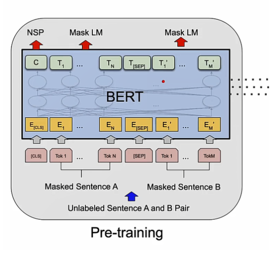

input经过三层embedding后求和，分别是词元本身的向量，所在句子信息向量和整体的position向量，如下图所示。

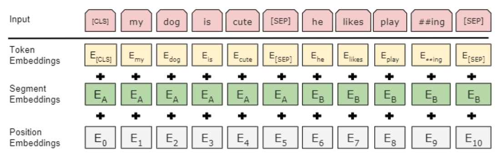

以上为预训练和微调的相同部分。

在预训练时对于每个序列的wordpiece的词元随机选取了15%来进行替换，但由于微调时不存在[MASK]符号，这将导致预训练和微调时数据的不匹配。为了缓和这一问题，将15%被选中的词元中80%的用[MASK]替代，10%的随机替换一个词元，剩余10%不进行操作。以上三种情况都会被标记为用来做预测。

微调时由于句子对放到了一个Transformer块中，所以self-attention可以来回看，比起encoder-decoder架构更优，由此付出的代价是无法再做机器翻译了。

### 3. ResNet

②摘要

提出了一个可以简化深层神经网络训练复杂程度的残差学习块，并通过大量实验证明了，残差网络更容易去优化，并且在相当深的网络中仍然能提高精度。ResNet在ImageNet数据集上，使用比VGG Net深8倍的层数，即152层，仍然有更低的复杂度。这些层ResNets在ImageNet测试集上的错误率仅为3.57%。这一结果在ILSVRC 2015分类任务上排在首位。本文也完成了在CIFAR-10数据集上用100和1000层的结果分析。

③结论

CVPR要求正文不能超过8页，故由于本文实验结果太多，最终没有结论

本文优势：We can fairly compare plain/residual networks that simultaneously have the same number of parameters, depth, width, and computational cost(except for the negligible element-wise addition).

④导言

不收敛->精度不高->ResNet提升精度

显然不同数据集上结果较好的，都是使用较为深的神经网络。但好的神经网络却不是简单地去堆叠层数就有效果的。这就是由于梯度消失、梯度爆炸的存在，这一问题会阻碍模型数据的收敛，但也被初始化时的归一化操作和中间的归一化层较好地解决了。收敛问题解决后，仍然存在着深层神经网络精度不高的问题，这一相较于浅层神经网络而言精度下降的问题，并不是由于模型的过拟合导致的。

解决这一问题的方法是，将新添加的层采用identity mapping（恒等映射），其他层相较原来的浅层网络模型不变。

本文则是采用了另一个方法解决degradation问题，一个深的残差学习架构。将下层的映射定义为$H (X)$，对于叠加的非线性层采用的映射为$F(X)=H(X)-X$, 原本的映射就成了$F(X)+X$. 该映射可以被认为是一个带短接的前馈神经网络。Shortcut connections(短接)是指跳跃一层甚至多层的一个恒等映射，该短接会与残差块的最后一层输出相加，如图所示

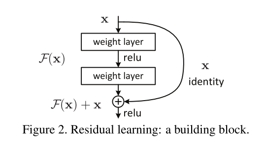

这一短接操作，既没有增加额外的参数，也没有增加计算的复杂度。整个网络也仍能使用随机梯度下降算法通过反向传播来进行端到端训练。

在使用ImageNet为数据集进行的对比实验中发现，1）使用残差连接块的深层网络容易去优化，而对应的不使用残差连接块的网络训练错误率会随着网络的深度增加而变高。2）残差网络的精确率会随网络深度的增加而提高。这一实验效果也同样出现在CIFAR-10数据集上。具体来说，在ImageNet 测试集上的Top-5 error达到了3.57%，并且在ILSVRC 2015分类竞赛上赢得了第一名。不仅如此，这一深度学习模型还有很好的泛化性，在ImageNet detection、ImageNet localization、COCO detection、COCO segmentation都拿到了2015年竞赛的第一名，这说明了残差连接的普适性。

⑤相关工作

有做过Residual Representation的：

VLAD、Fisher Vector(a probabilistic version of VLAD)

与残差连接公式出现的: "highway networks"，该网络的短接操作是连接门控的，该门控可以对短接通过参数进行调整，而不像残差连接中的短接，是参数无关的。该方法的弊端是，当门控参数趋近于0时，短接的效果将会消失，这与不进行短接并没有区别。并且‘’highway networks‘’文章中并没有表明深度超过100层时精确度是否有提升(多少有点杠，highway文章中最深100 layers)

⑥模型

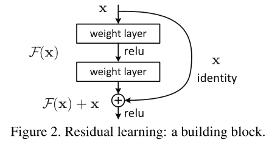

该残差块等价于公式
$$
y = F(x, \{W_i\}) + x.
$$

 其中$F(x, {W_i})$表示的是需要学习的残差映射，对应上图为$F=W_2σ(W_1x)+b$，σ此处使用的是relu函数，shortcut connection短接操作即实现了$F(x)+x$,并且在进行短接之后，又进行了一次relu操作。

公式中F和x的维度必须是相等的，当由于进行维度变化导致维度不一致时，可以引进一个$W_s$，将公式改为：
$$
y=F(x,\{W_i\})+W_sx.
$$

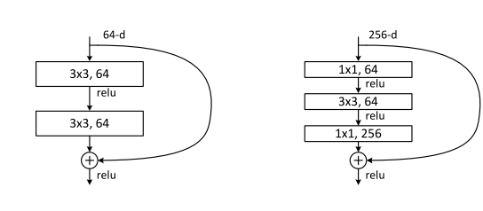

残差块的大小(即中间跨越的层数)是可以变化的，即可以跨越多个层，本文使用的是2~3层。但是连接只跨越一层时公式(4)的效果就等价为了$y=W_1x+x$，相当于残差退化为了一个bias，故对模型的精准度没有任何帮助。

另一个重要的点是，残差对于不同类型的中间层都有着优化效果，比如中间层是MLP、CNN都可以

公式(4)当且仅当输入输出维度相同时才可以使用，当维度不同时，本文给出了两种方法A：短接参数不变，对于增加的维度对应补0，该方法没有引入额外参数 B：使用公式(5)去进行维度匹配

在具体应用时，在每个卷积层后激活函数前，都进行了Batch Normalization操作，使用了批量大小为256的mini-batch通过随机梯度下降进行训练。并将学习率从0.1开始，每当错误率趋于平稳时进行除10操作。使用了weight decay 参数为0.0001并且将momentum设置为0.9，但并没有用dropout(因为没有全连接层

⑦实验	

图片分类实验部分，使用了ImageNet 2012 classification数据集，该数据集中包含1000种图片类别。训练集中包含128万张图片，验证集中有5万张。最终评估结果的测试集中为10万张，并且计算了top-1和top-5 error rates

为了对比，构建了两个18层和两个34层的模型，分别称为plain和ResNet，区别为ResNet添加了残差连接

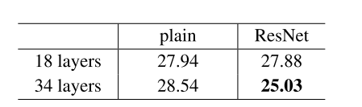

实验结果显示：添加了残差连接的ResNet随着神经网络深度的增加，精确度仍能提升，而plain则会随着深度增加精准度下降。并且同为18层时，二者的效果区别不大。

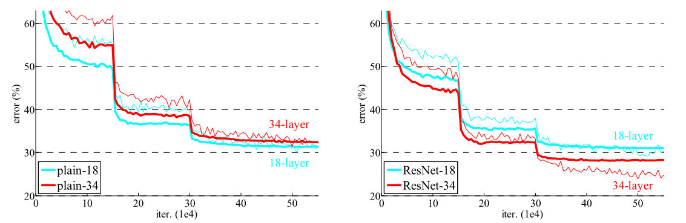

但是，同为18层的ResNet的收敛速度相比plain要快(对比前期第一次骤降之前)。

实验还对比了对于三种不同的残差连接公式选择的影响，A：对于维度增多的采用补0升维度的策略 B：对于需要升维度的使用公式(5)即做投影，其他所有短接采用(4)即恒等映射 C：所有短接都用公式(5).

最终结果是C>B>A，但是他们之间的差别是细微的如下图

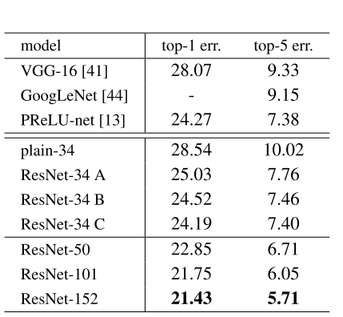

由于使用C会增加模型的复杂度，故作者并未使用C，而是使用B来完成后续实验(B只会做几次维度改变，故复杂度增加不大)

⑧评论

question: 

1.$F(X)=H(X)-X$如何实现

2.BatchNormalization在relu之前和之后有什么区别

3.为什么34层residual复杂度比19层VGG低

4.为什么短接方案C相较B会更精确，即C中有什么因素导致精度变高

5.深度增加在不使用ResNet的情况下为什么越深越不好

Thinking:

1.残差连接进行短接时F(X)+X中X传递添加可学习的系数，并且该短接默认存在于任意两层之间。（即是否存在有一些时刻，进行短接后效果反而不好，而添加系数，并对关键节点系数波动范围加以限制，是否会比一直默认恒等映射要好）。论文highway中提到了使用gate门

2.有效果的原因是用短接来引导整个模型(同时也避免梯度消失)

### 4. GPT

①标题+作者

②摘要

自然语言理解任务多样性强，比如有文本蕴涵、Q&A、语义相似性评估、文本分类等。对于这些任务，虽然有大量无标记文本，但是对于具体任务的有标记数据却很少。于其分门别类地去设计适用于每个具体任务的模型，我们提出了一个可以从大量无标记数据集上训练出可以只经过具任务数据的输入和模型的微调就能适配各个具体任务的模型。我们这一无视具体任务的模型在常识推理上提升了8.9%的精准度，在Q&A上获得了5.7%的提升，文本蕴含上则有1.5%的提升。

③结论

④导言

在使用无标号文本时遇到的困难：1.难以选定优化目标函数以获得更容易迁移的文本表示2.如何有效地将已经学到的文本表示迁移到具体任务上

本篇论文使用了半监督方法应用于语言理解任务，该方法包括了无监督的预训练和监督的微调。其目的是使模型学习到一个通用的可以简单调整久就能迁移到其他任务的表达。

在这一设定中，并不要求目标任务与无标记的语料库在属于同一领域。

整个训练过程分为两个阶段：第一步是使用无标记数据建模语言模型从而学习到神经网络模型的初始化参数。第二步，使用目标任务的有标记数据集对模型参数进行微调。

整个模型的架构使用的是Transformer，其在机器翻译、文本生成、句法分析等多个任务领域已展现出了非常好的性能。该模型提供了有利于处理文本中长周期依赖/关联的更有结构性的记忆架构。在迁移阶段，处理的结构化文本输入将被看作是一个连续的词元序列，该调整使得微调时只需要稍微修改预训练模型就可以取得很好的效果。

论文中的方法在四种语言理解的任务上进行了评测：1.自然语言推理 2.Q&A 3.语义相似性 4.文本分类

⑤相关工作

本篇论文工作从属于**半监督学习**(pretrain无监督+fine-tuning有监督)

GPT、Bert所使用的方法已经被称为**自监督学习**(self supervised learning)

此前研究人员已证明了，通过使用大量无标记数据集去训练word embeddings可以将其用来提高多种任务的效果。但是这一方法，只是传递了词级别的信息，本文意在获取更高层级的语义信息。

先前也有人探索了使用短语级或句子级的嵌入同样也是使用大规模无标签的数据，最后在那个把文本编码成对于多种任务合适的向量表示。

**无监督预训练**其目的是找到一个表达良好的初始化，在早期有应用于图像分类、回归问题中。后来的研究证明，预训练作用类似于正则化方法，使得整个模型泛化性更强。最近的工作中，该方法被用来帮助在图片分类、语音识别、实体歧义消除、机器翻译等领域训练深度神经网络。

与GPT最接近的工作是使用语言建模目标去预训练神经网络，然后在具体任务上进行有监督的微调。但由于其使用的是LSTM模型，从而使得性能受限。

GPT则使用了transformer神经网络，从而能捕捉到更长范围的语义结构。其高效性，在自然语言推断、释义检测、故事续写任务上得以验证。

还有一些方法在具体任务上进行监督学习时，使用了从预训练或者机器翻译模型中得到的隐藏表示作为辅助特征，该方法增加了大量参数。

添加辅助的无监督训练目标是半监督学习的另一种形式，辅助NLP任务的方法，有如词性标注、组块分析、命名实体识别和语言建模，以提高语义角色标注，GPT同样也使用了辅助对象

⑥模型

**无监督预训练**

对于所给的序列tokens，GPT使用标准的语言模型建模目标去最大化以下公式的可能性
$$
L_1(U) =
\sum_{i}
log P(u_i|u_{i−k}, . . . , u_{i−1}; Θ)
$$
k是上下文窗口的大小，概率P是使用有θ参数的神经网络建模出来的，θ所代表的参数，由SGD训练而来。

实验中使用了多层的Transformer解码器作为语言模型，该模型对经过向量编码前馈神经网络的输入tokens进行了多头的自注意操作，最终生成了对于目标tokens的分布。
$$
\begin{aligned}
&h_0 = UW_e +W_p \\
&h_l = transformer\_block(h_{l−1})\space ∀i ∈ [1, n]\\
&P(u) = softmax(h_nW^{T}_e)
\end{aligned}
$$
U是tokens的内容向量，n是层数，We是token嵌入矩阵，Wp是位置嵌入矩阵

**有监督微调**

在训练好好公式(6)中的模型目标后，GPT调整参数去适应监督学习的目标任务。对于带标记的数据集C，其中的每个实例都由一个输入序列$x^1,……，x^m$和标签$y$构成，该输入序列经过预训练模型最终由transformer块的$h^m_l$进行激活，然后经过线性输出层通过参数$W_y$去预测y：
$$
P(y|x^1, . . . , x^m) = softmax(h^m_l W_y).
$$
这就是的我们可以去最大化以下目标
$$
L_2(C)=\sum _{(x,y)}log P(y|x^1, . . . , x^m).
$$
作者发现：加入语言模型作为微调的辅助目标有利于提高监督模型的泛化性，并且能加速模型的收敛。具体来说，将以下作为目标：
$$
L_3(C) = L_2(C) + λ ∗ L_1(C)
$$
总之，在微调阶段所需的额外参数就是$W_y$，并且为分隔符进行嵌入。

对于某些任务，仍然还需要对其输入进行结构化比如Q&A任务、文本蕴含任务将句子对有序化或者构造文档、问题、答案的三元组。GPT使用遍历风格的方法，将结构化输入转变成一个有序的序列，这样预训练模型就可以处理它了。这样的输入转变，使得我们在处理不同任务时避免了模型架构上大量的改变

⑦实验

在无监督预训练阶段使用的数据集是BooksCorpus，其中不乏有长篇幅的连续文本内容，使得生成式模型可以学到长距离的信息。其替代品是ELMO使用的1B Word Benchmark，但它的缺点是将句子级的数据随机打乱了，从而不利于模型的训练

模型整体同transformer区别不大，训练了12层的decoder，使用了带掩码的多头自注意(768维的状态和12个头)。对于全连接层使用了3072维的内含状态，优化策略使用了Adam，最大学习率是2.5e-4，学习率在前2000次更新时从0开始线性增长并开始使用cos函数降低到0。使用了batch_size=64的随机选取的mini-batch进行了100个epochs的训练，其中每个mini-batch中有512个连续的tokens

在微调阶段，除特殊情况外，直接沿用了预训练时的超参数设置，并为分类器添加了参数为0.1的dropout。对于大多数任务，use a learning rate of 6.25e-5 and a batchsize of 32。

⑧评论

question:

1. 为什么在无监督预训练相关工作中说：预训练充当了一个正则化方案，使得模型有了更好的泛化性(不应该是无监督预训练为文本在多维空间中预选到了一块较为好的区域？如果以类似字型接近度同等地在计算机表达中也靠近，那样无标记的数据在训练完后将天然地在多维空间中靠近)
2. 为什么模型介绍3.2中加入语言模型作为微调阶段的辅助目标有助于a)提升泛化性b)加快了收敛
3. GPT会从多任务训练中获益？

### 5. GPT2

语言模型是多监督的多任务学习者

进行了多任务预训练使用超大数据集和深层模型，模型参数量达到了15亿个，并且在webtext的数据量下仍然欠拟合。

使用了zero-shot即在下游任务改造时不适用有标号的数据，使用该方法后在下游任务改造时不能出现模型从未见过的特殊符号，故需要新的方法对模型进行prompt提示

### 6. GPT3

对比zero-shot、one-shot、few-shot

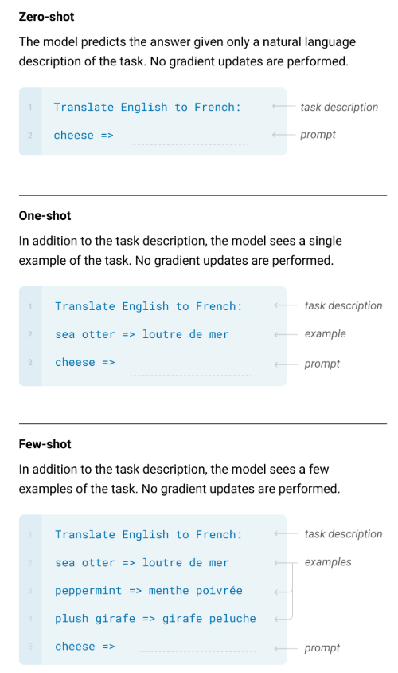

few-shot无法做到将上次的同类问题的提示记住，而是每次预测都要添加提示信息

局限性：1）长文本生成上比较弱 2）有结构和算法上的局限性 ，不能像bert一样能够往前看 3）每次预测下一个词时名不能分辨出已知词哪个更为重要 4）样本的有效性不够 5）多样本进行上下文学习时不确信其是否从头开始学，还是从之前所学样本中找出相关

## 对话生成

### 大规模中文短对话数据集LCCC

①标题+作者

清华大学王义达  https://www.bilibili.com/read/cv8946802 、郑银河

②摘要

短文本对话需要一个大规模高质量的数据集来训练，本文即提出了一个清洗过的中文对话数据集LCCC，其含有一个base版本内有680万个对话，另外一个large版本，内有1200万个对话。数据清洗使用了严格的标准，该标准由一系列规则和一个在人工标注的11万个对话数据对上训练出的分类器组成。同时，作者也对两个数据集分别进行了预训练。

③结论

④导言

BERT推动了自然语言理解类任务，GPT极大提升了自然语言生成类任务的精确度。

除了这些高效的基于Transformer的大模型，一个好的对话数据集同样很关键。

本文所创建的LCCC可以作为开放领域中文对话生成的benchmark数据集

⑤相关工作

当前数据驱动的对话系统大都是基于公共平台资源或者众包数据集。公平平台资源规模大，但有大量噪声数据需要被清理；众包资源质量高但是数据量小。

GPT出现后所预训练的Chinese GPT模型所使用的数据集是Chinese Wikipedia2 (1.7B words)和Chinese News (9.2B words)

本数据集使用的是从微博上爬取的7千9百万个对话，对些对话进行清洗后得出了**LCCC-base**。 又在添加若干中文对话数据集后得到了**LCCC-large**。整个清洗的过程包括基于规则和基于分类的过滤

⑥模型

模型部分使用的是基于transformer的GPT，decoder使用的是带掩码的多头自注意力块

对于给定的回复和历史对话信息，y = (y1, ..., yL)和U = {u0, ..., un}对于生成的U($u^1_{n+1}, ..., u^{j−1}_{n+1}$) 通过利用最大近似估计maximum likelihood estimation $∏^L_{j=1} P(y_j|y_1, ..., y_{j−1}, U)$去生成$u^j_{n+1}$，直到遇到结束符截止

整个历史对话信息被concate到了一个长文本序列。模型输入是word embedding, speaker embedding, 和position embedding的总和，word embedding、position embedding是在预训练阶段所学到的，speaker embedding则是在后训练或者微调时学到，speaker embedding用来表示不同的讲话人。同Bert一样将[CLS]作为序列的开始标记，[SEP]作为序列的终止标记

同DialoGPT一样，整个模型是在一个中文预训练模型GPT_novel上使用我们的数据集进行的post-trained

在处理多轮对话时同DialoGPT一样 我们将对话中的每句话，从第二句到最后一句作为历史句的回应(?不太懂)

具体模型以及训练次数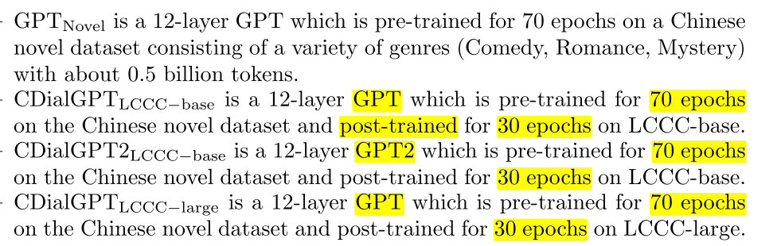

对于所有模型都选用AdamW为优化器，Noam作为学习率衰减方法，层数都为12层，注意力头数12，word embedding维度为768，position embedding 维度 513，最大学习率6.25e-5，batch_size=8，梯度加速度(?？)=64

⑦实验

为了评价这些模型，将他们在STC数据集(contains 4.4M conversation pairs)上进行微调

本文使用的baseline：GPT2chitchat、Vanilla transformer、Attn-Seq2Seq(consists of 6 layers of GRU with Bahdanau attention mechanism the dimension of hidden states is set to 768,the transformer are also set to 6)

⑧评论

### GODEL : Lare-Scale Pre-Training for Goal-Directed Dialog

①标题+作者

Microsoft Corp

②摘要

GODEL利用了新的基础预训练来使其更好地支持范围更广的那些，需要对当前对话引入外部知识的下游任务来使其产生更好的回复。实验对比了一系列基准模型，包含任务导向的对话、问答对话、基础的开放域对话，结果表明GODEL在人工评测、自动化评测上都达到了当前预训练对话模型(微调阶段使用了few-shot)最好的水平(SOTA). 在本文评估方法中，新增加了一个特征，即**utility**有用性这个概念(即评估回复的有用性[extrinsic evaluation]，而不是只关注于其交流过程中相关的特征[intinsic evaluation]，即流畅性)。引入有用性特征后，更有助于提高评分者间意见的一致性与自动化评分间的相关性

③结论

④导言

GODEL是为general-domain广域对话设计的完全开源的预训练模型。其有两大亮点：1.将预训练分为了三个阶段，

 1) Linguistic pre-training on public web documents to gain the capability of **text generation**. 

2) Dialog pre-training on public dialog data to learn to **chat like a human**.

 3) Grounded dialog(有基础的对话) pre-training to enable a dialog model to generate responses grounding on specific goals. i.从web文本中连续折叠数据ii.使用如Reddit之类的公开对话数据iii.一系列现存的支持基础对话任务的语料库

其中基础对话语料库包括MS MARCO、DSTC7，其能使得微调时有效帮助到那些需要产生有关外部知识的回复。

2.GODEL的验证是有用性驱动的，使用的是一套为**开放领域任务导向的广域对话模型**(open-ended goal-directed general-domain dialog models)设计的基于有用性的基准。使用了该有效性检验方法后，GODEL对于任务导向对话的微调效果比其他大型的预训练语言模型要好。

没有一个鲁棒性的自动评估标准一直是广域开放对话模型的一大问题，最近的一些SOTA预训练模型，往往因为缺少一个认同度高的评价标准而没有进行有意义的比较。

而要制定一好的标准，我们则要回归初衷，不应是只关注对话回复的流畅度和其社交能力这一从交流来看的内在维度，而应该关注其有用性这一外在维度，即对话系统所生成的回复应对用户有用才行。

文本用GODEL在四个任务上进行fine-tuning，并探索有用性这一概念，这些任务有：任务导向的MultiWOZ、开放域目标导向的任务比如CoQA、Wizard of Wikipedia和Wizard of the Internet

GODEL相比于baseline DialoGPT在目标导向的任务上做的更好，对于在不同任务上的结果证实了本文方法的有效性。并且当聚焦于目标导向和外在评价时，评分者间意见更具有一致性且评估指标更具有相关性。

本文提供了多个版本作为baseline，$GODEL_B$、$GODEL_L$、$GODEL^{GPT-J}_{XL}$

⑤相关工作

大规模的预训练模型对对话领域已经产生了巨大影响，比如DSTC、ConvAI就已经在竞赛中取得了好成绩，并且在任务导向、闲聊方向都得到了广泛应用。然而对于这些预训练模型的实验评估仍局限在内在的如Relevance、Informativeness、Humanness还有各种基于字符重叠的自动化评估标准，DialoGPT提供的基于Reddit的预训练模型也即如此评估的。Meena的评估着眼于Sensibleness合理性和Specificity明确性，同时也提供了一个新的自动评估方法SSA，从这两个维度去进行评估。BlenderBot的模型利用了各种技术包括人性化、共情化、知识化，但其评估标准却是人性化和新颖度。Plato-XL使用内在标准：Coherence, Inconsistency, Informativeness, Hallucination, and Engagingness。而Plato-XP在评估DSTC9-Track1、MultiWOZ 2.2、DuConv时使用了一些外在标准，但是都是使用的基于具体任务的自动评估(ROUGE-L for DSTC9, Goal-Accuracy for MultiWOZ, and KnowledgeF1 for DuConv)。

本文则是提供了更为统一化的对有用性的评测标准，即用统一的方式比如相同的注释结构

LaMDA在进行初步评估时使用了内在特征，但在人工评测阶段考虑了外在特征即有用性

先前的一些任务导向的对话中已经用了大量的有用性的评测标准比如Inform-rate and Successrate for MultiWOZ，Knowledge-F1 for Wizard of Wikipedia，这些定制化的评价标准往往具有异质性，并且只能应用于有限的子任务，这使得分析跨对话任务和数据集较为困难. 本文解决这一局限性的方法为，提出了一个人工评测的统一标准，比如当一个评分员被要求为一个餐馆领域的对话系统进行评分时，他对于能给出推荐或者给出一些餐馆信息的系统所给的分数就应该比一个只会闲聊的系统要有更高的有用性分数。

有用性在任务导向对话中的普适程度就相当于在闲聊对话中的人性化和有趣性，并且其与自动评价的相关度更高

⑥模型

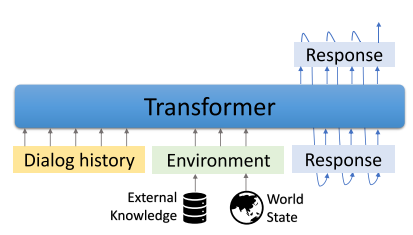

⑦实验

本文评估了两种配置的预训练模型，few-shot和full。但由于任务导向的对话数据集构建的成本更高，并且比闲聊数据集更小，因此本文想评估即使微调样例相对少的情况下模型仍能表现很好。并且本项目关注于对话语言模型的预训练，few-shot少样本学习能更好评估该预训练模型。再者，少样本微调是现实应用场景所用的方法

⑧评论

thinking: 各领域现在的评价标准一定是最合适的吗，有哪些领域的亟待修改？修改评价标准后对领域内模型的发展趋势，以及模型进步的速度是否有影响？评测标准注重于有用性就是好的吗？

分阶段递进预训练是必要的

A survey：different works' evaluation methods and their correlation with attributes?

question：Third, few-shot fine-tuning is a realistic approach in application scenarios where it can facilitate fast turnaround of updated models and greater developer control over model characteristics.？？

**文末附录中有人工评测具体表**

### Open-Prompt

①标题+作者

一作丁宁清华大学计算机科学与技术系博士生。师从郑海涛教授，也得到了刘知远教授的共同指导。主要研究自然语言处理和机器学习。尤其是知识表示、提取和应用。

②摘要

提示学习已经称为NLP新范式，即直接调整预训练模型来完成完形填空风格的预测、自回归建模或者序列到序列的生成。然而对于提示学习的应用仍没有一个具体的框架。现存的提示学习代码库，通常是无规范的，只能局限地应用于某些具体的应用场景。导致该情况的是由于一些比如：无法统一的模板化策略、初始化策略和verbalizing strategy等, Open-prompt即提供了统一的方法，**其组合能力允许将不同的预训练模型自由组合**，具有很强的可扩展性 。

③结论

④导言

预训练语言模型引领了NLP的新时代，早期，调整预训练模型使其能完成各种具体的NLP任务时使用预训练+微调的范式，其需要额外的参数和具体任务的训练目标(损失函数)。但从T5和GPT-3开始，研究者发现文字提示或说明对于PLM有很好的引导作用。

以情感分类为例，需要设计一个模板和标签-单词映射器verbalizer，模板即文本+标识符号。假设template是"<text> it is <mask>"其中<text>代表原始的文本，此处映射器verbalizer是{“positive”:“great”, “negative”:“terrible”}

句子“Albert Einstein was one of the greatest intellects of his time.” 将会被预定义的模板包装为“Albert Einstein was one of the greatest intellects of his time. It is <mask>”，包装后的句子将经过分词后输入PLM去预测<mask>上可能出现单词的分布，从原始文本中可直，此处我们希望得到‘’great‘’的概率比“terrible”的概率大一些。

之后围绕着如何构建模板、映射器、优化和应用来对提示学习这一新范式展开了研究。

提示学习可以被认为是与训练语言模型、人类先验知识和具体NLP任务的综合。现有的深度学习或自然语言处理库并不能很好的支持提示学习的应用，并且也没有一个基础的规范。先前工作都是在最有效的传统微调的方法框架上做最小的修改，导致了很差的可读性甚至难以复现。尤其是提示学习的表现受模板和映射器选择的影响极大。目前也没有一个为提示学习设计的开源框架，使得新旧工作进行严格对比非常困难。

本文一大卖点就是设计的提示学习框架中支持多种任务格式(分类任务和生成任务)、PLM(MLM、LM和Seq2Seq)、提示模块(不同的模板和映射器)的灵活组合。比如我们可以非常便易地将前缀微调与文本分类任务相适配。OpenPrompt这一特性可以使得用户在不同任务上评测自己提示学习模型的泛化性，而不局限于具体某个任务。

OpenPrompt具体设计有：Template类、Verbalizer类、PromptModel类

Template中为实现多种模板的统一范式，设计了新的模板语言，该语言可以实现为对应特征进行词元token级别的定制化，比如用户可以定义哪些词元是共享词嵌入的、可训练的或这些词元应进行怎样的后期加工处理

⑤相关工作

传统的微调面临着两个问题：1）该方法会在预训练与微调之间产生一个鸿沟2）随着模型参数量的增加，微调的可操作性变得越来越小

⑥模型

**Combinability**

在Open-prompt的框架下，从模型观点来看，T5将不再仅用于预测寿命，GPT将不再只用于生成任务

从提示学习的角度来看，前缀调优将可以用来进行分类任务，软提示也将能用来完成生成任务。

**Pre-trained Language Models**

由于提示学习意在通过减少预训练与下游任务应用之间的区别去提高精度，因此介绍了不同的PLM

预训练语言模型分为三大类：MLM、自回归风格的LM、seq2seq模型(常见的有T5、MASS、BART)

OpenPrompt支持直接从huggingface transformers直接加载预训练模型

**Tokenization**

在设计好模板后，原本具体应用于具体的输入以及模型的分词方法，将会变得耗时且有错误率

其封装好的数据处理API可以同时处理输入和模板，组件对从输入和模板融合的复杂信息进行分词，根据预训练语言模型选择的不同，OpenPrompt自动选择合适的分词器

**Template**

模板模块将原始文本与文字的或是软编码(可训练的)模板打包在一起，OpenPrompt中所有模板都继承自一个基类其中含有共通的特性和抽象方法

先前对于模板的设计，有人工编写的和纯软(可训练的)的模板。后出现的二者的混合版本效果有时会更为好一点，最近的一些工作中的提升是通过修复大量的手工词元，同时调优一少部分其他词元来实现。

模板语言借鉴了python中dict字典的语法特点，这样设计可以同时保证灵活性和简洁性

具体设计为一个模板节点由一个text和一个特征描述组成。在模板语言中，每个词元的特征是可编辑的，如设置一些特征共享embedding，设计特征如何进行后处理。

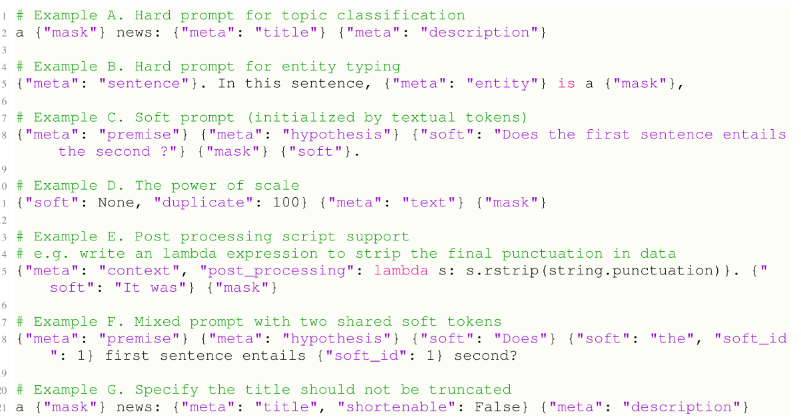

**Verbalizer**

标签单词映射器在分类任务中是必不可少的

**PromptModel**

该类实例化的对象负责训练和推理，它包含PLM、模板对象，和一个标签单词映射器(可选)

基类中使用了一种模型无关的前向传播方法去预测应该加掩码的单词位置，从而可以无视预训练中的目标函数，只调用API就能”预测需要预测的位置的单词(即找到合适的加mask的位置)“

**Training**

从参数可训练角度出发，提示学习的训练可以分为两种策略：1）同时调整提示和预训练模型 2）只调整提示的参数，而预训练模型保持不变

其中第2个方法被认为更有前景

⑦实验

⑧评论